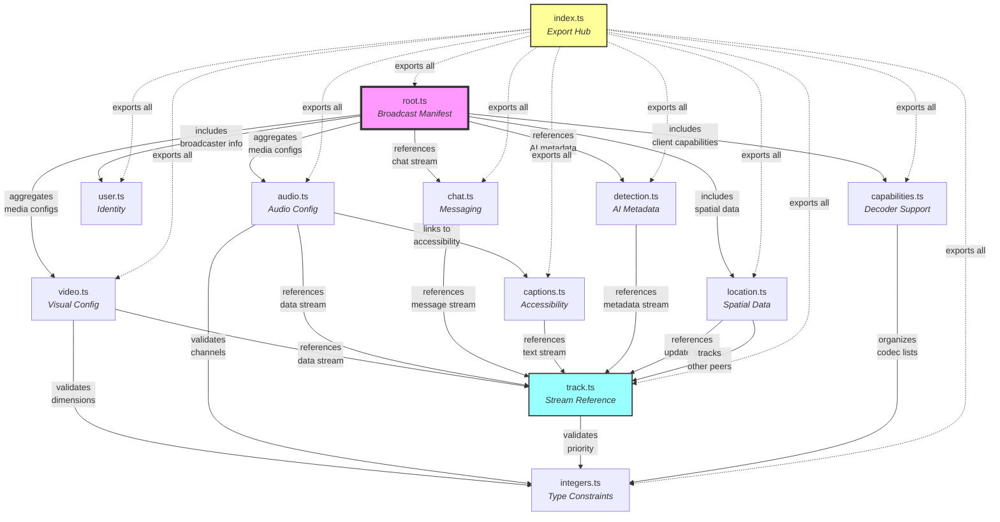

# Catalog Module Documentation

## Table of Contents

- [Overview](#overview)
- [Purpose](#purpose)
- [Core Schemas](#core-schemas)
  - [Root Schema - Broadcast Manifest](#root-schema---broadcast-manifest)
  - [Track Schema - Stream References](#track-schema---stream-references)
- [Media Schemas](#media-schemas)
  - [Video Schemas](#video-schemas)
  - [Audio Schemas](#audio-schemas)
- [Feature Schemas](#feature-schemas)
  - [User Schema - Identity](#user-schema---identity)
  - [Location Schemas - Spatial Positioning](#location-schemas---spatial-positioning)
  - [Chat Schema - Messaging](#chat-schema---messaging)
  - [Captions Schema - Accessibility](#captions-schema---accessibility)
  - [Detection Schemas - AI Metadata](#detection-schemas---ai-metadata)
  - [Capabilities Schemas - Decoder Support](#capabilities-schemas---decoder-support)
- [Utility Schemas](#utility-schemas)
  - [Integer Schemas - Type Constraints](#integer-schemas---type-constraints)
- [Module Organization](#module-organization)
- [Architectural Relationships](#architectural-relationships)
- [Key Design Principles](#key-design-principles)
- [Usage Pattern](#usage-pattern)
- [Integration Points](#integration-points)

## Overview

The catalog module defines the **metadata structure** for media broadcasts in the hang library. It provides a **type-safe schema** that describes what content is available in a broadcast and how to access it. Think of it as a **manifest** that tells consumers everything they need to know to consume a broadcast's media streams.

> 💡 **For Beginners: What's a "type-safe schema"?**
> 
> A schema is like a blueprint that defines what data should look like. "Type-safe" means TypeScript will check at compile-time that your code uses the correct data types (strings, numbers, etc.) in the right places. This catches bugs before your code runs! The catalog uses Zod, a library that also validates data at runtime, ensuring incoming data matches the expected format.

## Purpose

The catalog serves as a **contract between publishers and consumers**, enabling:
- **Discovery** of available media tracks (video, audio, chat, etc.)
- **Configuration** specifications for decoders
- **Identity** information about the broadcaster
- **Spatial awareness** through location data
- **Accessibility** features like captions
- **Intelligence** via object detection metadata

## Core Schemas

### Root Schema - Broadcast Manifest
**File**: `root.ts`
**Achieves**: Defines the complete metadata structure for a broadcast and provides serialization/deserialization capabilities.

The root catalog acts as the **entry point** that aggregates all broadcast metadata. It describes:
- What media tracks are available (arrays of video and audio configurations)
- Who is broadcasting (user information)
- What additional features are enabled (chat, location, detection)
- What the client's capabilities are

This file also provides the **transport layer** for the catalog, converting between the typed schema and the byte arrays transmitted over MoQ tracks. It includes:
- **JSON serialization** via `encode()` and `decode()` functions
- **Stream fetching** via `fetch()` that reads from MoQ track consumers
- **Error handling** with logging for invalid catalog data

> 💡 **For Beginners: What are "byte arrays" and "serialization"?**
> 
> - **Byte arrays** (Uint8Array in JavaScript) are raw binary data - think of them as a series of numbers from 0-255 that can represent any type of data
> - **Serialization** is converting JavaScript objects into a format that can be sent over the network (in this case, JSON text encoded as bytes)
> - **Deserialization** is the reverse - taking those bytes and turning them back into JavaScript objects you can work with

### Track Schema - Stream References
**File**: `track.ts`  
**Achieves**: Provides the addressing mechanism for individual data streams within a broadcast.

#### **What It Does**
- **Names data streams** - Each track has a unique identifier within a broadcast
- **Sets delivery priority** - Determines which data gets sent first when bandwidth is limited
- **Enables routing** - MoQ transport uses these references to deliver the right data

#### **Why It Matters**
- **Network efficiency** - Priority ensures critical data (like audio) arrives before less critical (like chat)
- **Stream organization** - Named tracks make it easy to subscribe to specific content
- **Quality of Service** - System can drop lower priority data when network is congested

#### **How It Works**

**TrackSchema fields:**
- `name: string` - Unique identifier for the track (e.g., "video", "audio", "chat")
- `priority: u8` - Priority level from 0-255 (lower = higher priority)

**Type exports:**
- `Track` - TypeScript type inferred from TrackSchema

> 💡 **For Beginners: What are "tracks" and "priority levels"?**
> 
> - A **track** is like a channel for streaming specific content (e.g., "video", "audio", "chat")
> - **Priority** (0-255) tells the system which tracks are most important when network bandwidth is limited - lower numbers = higher priority
> - **Multiplexing** means sending multiple streams of data over a single connection, like having multiple TV channels on one cable

## Media Schemas

### Video Schemas
**File**: `video.ts`  
**Achieves**: Describes everything needed to decode and render video content.

The video module provides two distinct schemas that work together:

#### **VideoConfigSchema - Decoder Configuration**
Mirrors the WebCodecs `VideoDecoderConfig` interface, providing all parameters needed to initialize a video decoder:

**Codec and initialization:**
- `codec: string` - Codec identifier (e.g., "h264", "vp9", "av1")
- `description?: string` - Codec-specific initialization data (hex-encoded, developer TODO: base64)

**Dimensions and display:**
- `codedWidth/Height?: u53` - Video dimensions in pixels
- `displayAspectWidth/Height?: u53` - Aspect ratio for pixel stretching
- `rotation?: number` - Rotation in degrees
- `flip?: boolean` - Horizontal flip flag

**Performance parameters:**
- `framerate?: number` - Frames per second
- `bitrate?: u53` - Data rate in bits per second
- `optimizeForLatency?: boolean` - Prefer speed over quality (default: true)

#### **VideoSchema - Complete Video Definition**
Combines the configuration with track reference to fully describe a video stream:
- `track: TrackSchema` - Reference to the MoQ track carrying video frames
- `config: VideoConfigSchema` - Complete decoder configuration object

This separation allows the config to be reused or transmitted separately from the track reference.

> 💡 **For Beginners: What are "codecs" and "WebCodecs"?**
> 
> - A **codec** (coder-decoder) is software that compresses/decompresses video - like "h264" or "vp9"
> - **WebCodecs** is a browser API that gives you low-level access to video/audio encoding and decoding
> - **Hex-encoded** means binary data represented as text using hexadecimal (0-9, A-F) characters
> - **Latency** is the delay between sending and receiving - "optimizeForLatency" prioritizes speed over quality

### Audio Schemas
**File**: `audio.ts`  
**Achieves**: Describes everything needed to decode and play audio content.

The audio module provides two distinct schemas that work together:

#### **AudioConfigSchema - Decoder Configuration**
Mirrors the WebCodecs `AudioDecoderConfig` interface, providing all parameters needed to initialize an audio decoder:

**Required parameters:**
- `sampleRate: u53` - Sample rate in Hz (e.g., 44100, 48000)
- `numberOfChannels: u53` - Number of audio channels (1 = mono, 2 = stereo)

**Codec information:**
- `codec: string` - Codec identifier (e.g., "opus", "aac", "mp3")
- `description?: string` - Codec-specific initialization data (hex-encoded, developer TODO: base64)
- `bitrate?: u53` - Data rate in bits per second

#### **AudioSchema - Complete Audio Definition**
Combines the configuration with track reference and optional captions:
- `track: TrackSchema` - Reference to the MoQ track carrying audio frames
- `config: AudioConfigSchema` - Complete decoder configuration object
- `captions?: CaptionsSchema` - Optional reference to caption/subtitle track for accessibility

This separation enables the audio config to be shared while maintaining different caption tracks for multiple languages.

## Feature Schemas

### User Schema - Identity
**File**: `user.ts`  
**Achieves**: Provides identity and personalization information about the broadcaster.

User information enables (all fields optional):
- **Unique identification** via `id` string
- **Display name** for human-readable labels
- **Avatar URL** for visual representation (developer TODO in code: consider track-based avatars)
- **Color preference** for UI theming

### Location Schemas - Spatial Positioning
**File**: `location.ts`  
**Achieves**: Enables spatial audio and video positioning in multi-user environments.

The location module provides two schemas for spatial awareness:

#### **PositionSchema - 3D Coordinates**
- `x?: number` - Horizontal position (-1 to +1) for placement and audio panning
- `y?: number` - Vertical position (-1 to +1) for placement
- `z?: number` - Depth/layering (larger = closer to viewer)
- `scale?: number` - Size representation (1 = 100%)

> 💡 **For Beginners: What's "normalized coordinates" and "audio panning"?**
> 
> - **Normalized coordinates** (-1 to +1) are position values that work regardless of screen size. -1 is left/bottom, 0 is center, +1 is right/top
> - **Audio panning** means making sound come from different speakers (left/right) to match where someone is positioned visually
> - **Z-index/layering** determines what appears in front when things overlap, like layers in Photoshop

#### **LocationSchema - Complete Spatial System**
- `initial?: PositionSchema` - Starting position at broadcast start (defaults to 0,0)
- `updates?: TrackSchema` - Track for real-time position changes (developer TODO: binary format)
- `handle?: string` - Identifier for bidirectional peer discovery
- `peers?: Record<string, TrackSchema>` - Map of peer handles to their position update tracks

### Chat Schema - Messaging
**File**: `chat.ts`  
**Achieves**: References a track for text-based communication alongside media streams.

Simple schema containing:
- `track: TrackSchema` - Reference to the track carrying chat messages

This minimal structure allows chat systems to be implemented independently while still being discoverable through the catalog.

### Captions Schema - Accessibility
**File**: `captions.ts`  
**Achieves**: References a track for real-time captions/subtitles.

Simple schema containing:
- `track: TrackSchema` - Reference to the track carrying caption/subtitle data

This enables accessibility features while keeping the caption format flexible for different implementations (WebVTT, SRT, etc.).

### Detection Schemas - AI Metadata
**File**: `detection.ts`  
**Achieves**: Provides computer vision results for detected objects in video streams.

The detection module provides three schemas:

#### **DetectionSchema - Track Reference**
- `track: TrackSchema` - Reference to the track containing detection metadata

#### **DetectionObjectSchema - Individual Detection**
- `label: string` - Object classification (e.g., "person", "car", "face")
- `score: number` - Confidence level (0-1, where 1 = 100% confident)
- `x, y: number` - Top-left position in normalized coordinates (0-1)
- `w, h: number` - Width and height in normalized coordinates (0-1)

#### **DetectionObjectsSchema - Batch Processing**
- Array of `DetectionObjectSchema` for processing multiple detections per frame

> 💡 **For Beginners: What's "object detection" and "bounding boxes"?**
> 
> - **Object detection** uses AI/ML to identify things in video frames (people, cars, faces, etc.)
> - A **bounding box** is a rectangle drawn around detected objects, defined by position (x,y) and size (width, height)
> - **Confidence score** (0-1) indicates how sure the AI is about its detection - 1.0 = 100% confident
> - **Normalized coordinates** (0-1) mean positions are relative to video size - 0.5 = middle, regardless of resolution

### Capabilities Schemas - Decoder Support
**File**: `capabilities.ts`  
**Achieves**: Declares what codecs the client can decode and how efficiently.

The capabilities module provides schemas for codec support negotiation:

#### **VideoCapabilitiesSchema & AudioCapabilitiesSchema**
Both schemas share the same structure:
- `hardware?: string[]` - Codecs with hardware acceleration available
- `software?: string[]` - Codecs that can only be decoded in software
- `unsupported?: string[]` - Codecs that cannot be decoded at all

#### **CapabilitiesSchema - Complete Capabilities**
Aggregates both media type capabilities:
- `video?: VideoCapabilitiesSchema` - Video codec support information
- `audio?: AudioCapabilitiesSchema` - Audio codec support information

This allows publishers to adapt their streams based on what receivers can efficiently decode.

## Utility Schemas

### Integer Schemas - Type Constraints
**File**: `integers.ts`  
**Achieves**: Provides validated integer types that match the constraints of the underlying protocols.

#### **u8Schema - 8-bit Unsigned Integers**
- Range: 0-255
- Used for: Track priorities
- Features: Branded type for compile-time safety, runtime validation via Zod
- Helper: `u8(value)` function for convenient creation

#### **u53Schema - 53-bit Unsigned Integers**
- Range: 0 to Number.MAX_SAFE_INTEGER (9,007,199,254,740,991)
- Used for: Dimensions, sample rates, bitrates
- Features: Ensures JavaScript number safety, branded type for distinction
- Helper: `u53(value)` function for convenient creation

> 💡 **For Beginners: What are "8-bit" and "53-bit" integers?**
> 
> - **8-bit unsigned integer** can store numbers from 0 to 255 (2^8 - 1). Think of it like having 8 switches that can be on/off, creating 256 possible combinations
> - **53-bit integer** is the largest whole number JavaScript can safely handle (9,007,199,254,740,991). Beyond this, JavaScript might lose precision
> - **Unsigned** means no negative numbers allowed - only zero and positive values
> - **Branded types** are a TypeScript trick that creates distinct types even though they're both numbers underneath - prevents mixing them up
> - **MAX_SAFE_INTEGER** is JavaScript's built-in constant for the largest safe integer (2^53 - 1)

## Module Organization

### index.ts - Export Hub
**File**: `index.ts`  
**Achieves**: Provides a single import point for all catalog types and utilities.

This barrel export file re-exports everything from:
- `./audio` - AudioSchema, AudioConfigSchema types
- `./capabilities` - CapabilitiesSchema and related types
- `./captions` - CaptionsSchema
- `./chat` - ChatSchema
- `./detection` - DetectionSchema and object schemas
- `./integers` - u8/u53 schemas and helpers
- `./location` - LocationSchema, PositionSchema
- `./root` - RootSchema and encode/decode functions
- `./track` - TrackSchema
- `./user` - UserSchema
- `./video` - VideoSchema, VideoConfigSchema types

This enables clean imports like `import { RootSchema, VideoSchema } from '@kixelated/hang/catalog'`

## Architectural Relationships

## Key Design Principles

1. **Declarative Configuration**: Each schema describes *what* content exists, not *how* to process it
2. **Type Safety**: Zod schemas provide runtime validation and TypeScript type inference
3. **Extensibility**: All fields are optional except core requirements (e.g., sampleRate for audio)
4. **Composability**: Independent schemas can be combined as needed
5. **Transport Agnostic**: Schemas define structure, not delivery mechanism
6. **WebCodecs Alignment**: Audio/Video configs mirror WebCodecs API for seamless integration

> 💡 **For Beginners: Understanding these principles**
> 
> - **Declarative** = You describe the desired outcome, not the steps to get there (like HTML vs JavaScript)
> - **Runtime validation** = Checking data is correct while your app is running, not just when coding
> - **Type inference** = TypeScript automatically figures out what type something is without you explicitly saying
> - **Transport agnostic** = The catalog doesn't care how data is sent (HTTP, WebSocket, etc.) - it just defines the format
> - **Composability** = Small, independent pieces that can be mixed and matched like LEGO blocks

## Usage Pattern

1. **Publisher** creates a Root catalog describing their broadcast
2. **Publisher** encodes the catalog using `encode()` function (JSON → Uint8Array)
3. **Publisher** publishes the encoded catalog on a designated track (typically "catalog")
4. **Consumer** fetches the catalog using `fetch()` or reads and `decode()`s manually
5. **Consumer** uses the catalog to discover and subscribe to desired tracks
6. **Consumer** configures WebCodecs decoders using the provided configurations
7. **Updates** to the catalog trigger re-evaluation of available content

## Integration Points

- **MoQ Transport**: Track references connect to the underlying MoQ protocol
- **WebCodecs**: Audio/Video configs match WebCodecs decoder requirements  
- **Web Components**: Catalog data drives the hang UI components
- **Reactive System**: Catalog updates trigger reactive UI updates