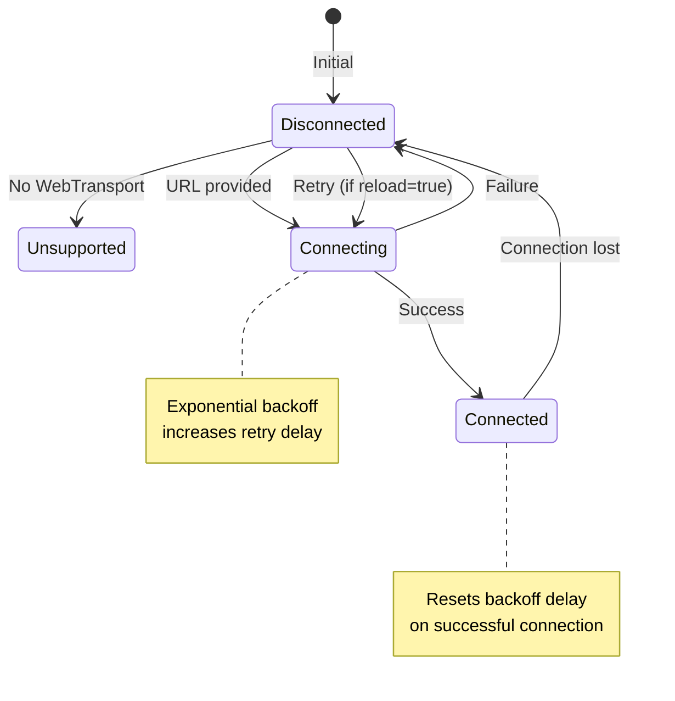
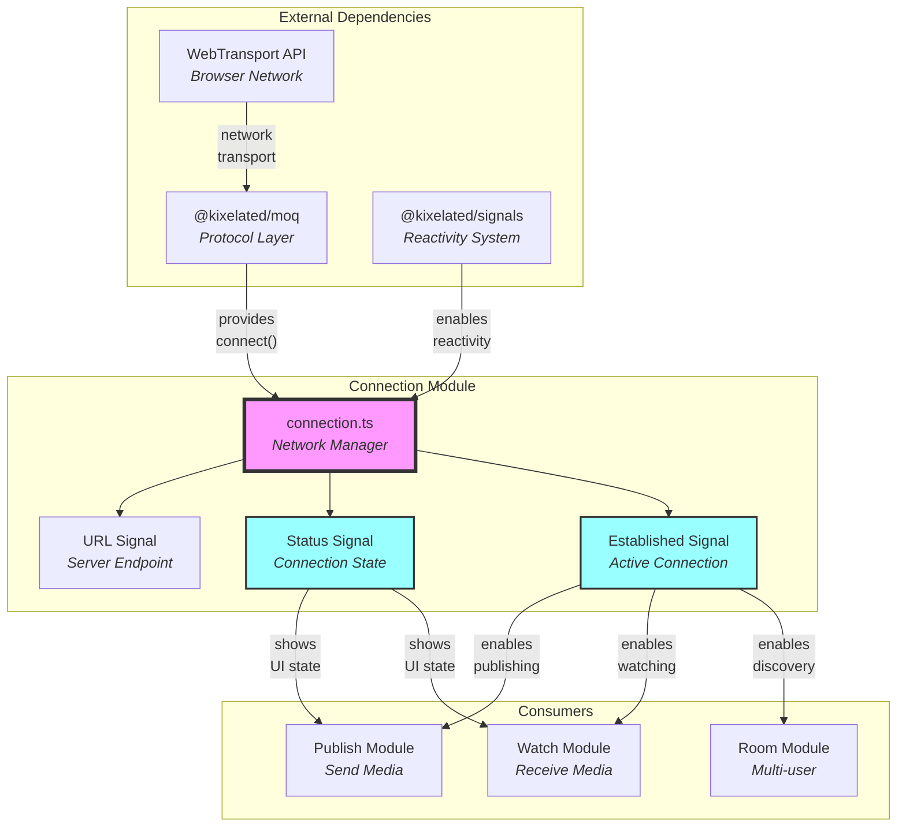

# Connection Module Documentation

## Overview

The connection module provides a **resilient WebTransport connection** to MoQ relay servers. It acts as the **foundation layer** that establishes and maintains the network link required for all media streaming operations. Think of it as a **smart network bridge** that handles connection lifecycle, automatic reconnection, and status reporting.

> 💡 **For Beginners: What's "WebTransport"?**
> 
> **WebTransport** is a modern browser API for real-time communication over the internet. It's like WebSockets but faster and more reliable, built on top of HTTP/3 and QUIC protocols. Perfect for streaming media with low latency!

## Purpose

The connection module serves as the **network abstraction layer**, enabling:
- **Persistent connectivity** to MoQ relay servers
- **Automatic recovery** from network failures
- **Status monitoring** for UI feedback
- **Reactive updates** when connection state changes
- **Graceful degradation** when WebTransport is unavailable

## File Description

### `connection.ts` - Network Link Manager
**Achieves**: Establishes and maintains a resilient WebTransport connection with automatic reconnection capabilities.

The Connection class provides:

#### **Core Properties (all are Signals)**
- **`url: Signal<URL | undefined>`** - The relay server endpoint (reactive)
- **`status: Signal<ConnectionStatus>`** - Current state: "connecting" | "connected" | "disconnected" | "unsupported"
- **`established: Signal<Moq.Connection | undefined>`** - The active MoQ connection when available

#### **Configuration Options**
- **`reload: boolean`** - Enable automatic reconnection (default: true)
- **`delay: number`** - Initial reconnection delay in milliseconds (default: 1000)
- **`maxDelay: number`** - Maximum backoff delay in milliseconds (default: 30000)

#### **Internal Mechanisms**
- **`#tick: Signal<number>`** - Private signal that triggers reconnection attempts (incremented on retry)
- **`#delay: number`** - Current backoff delay (doubles on failure via `Math.min(#delay * 2, maxDelay)`)
- **`signals: Effect`** - Reactive root for managing connection lifecycle
- **`#connect(effect: Effect)` method** - Private method handling the connection logic with effect parameter

> 💡 **For Beginners: What does the "#" symbol mean?**
> 
> The `#` prefix denotes **private class fields** in JavaScript - these properties and methods can only be accessed from inside the class itself. It's like having a locked drawer that only the class can open. This ensures internal implementation details stay hidden from external code.

#### **Reactive Architecture**
- **Signal-based state** - All public properties are reactive signals that trigger UI updates
- **Effect-driven lifecycle** - Connection attempts managed through `effect()` and `spawn()`
- **Automatic cleanup** - Uses `effect.cleanup()` to properly close connections
- **Race condition handling** - Uses `Promise.race()` with cancellation tokens

> 💡 **For Beginners: What are "Signals" and "Effects"?**
> 
> - **Signals** are like React state but more automatic - when a signal changes, anything using it updates automatically
> - **Effects** are functions that run when their signal dependencies change (similar to React's useEffect)
> - **Cancellation tokens** let you stop async operations cleanly when they're no longer needed
> - This pattern is called "reactive programming" - the UI reacts automatically to data changes

## Configuration Properties

The connection accepts these configuration options via `ConnectionProps`:

| Property | Type | Purpose | Default | Notes |
|----------|------|---------|---------|-------|
| `url` | `URL \| undefined` | Relay server endpoint | undefined | Must support WebTransport protocol |
| `reload` | `boolean` | Enable auto-reconnection | true | Triggers exponential backoff on disconnect |
| `delay` | `DOMHighResTimeStamp` | Initial reconnection delay (ms) | 1000 | Doubles after each failure |
| `maxDelay` | `number` | Maximum reconnection delay (ms) | 30000 | Caps the exponential backoff |

> 💡 **For Beginners: What's "DOMHighResTimeStamp"?**
> 
> `DOMHighResTimeStamp` is a high-precision time measurement type in browsers, representing milliseconds with microsecond accuracy (up to 5 decimal places). It's more precise than regular `number` for timing operations.

> 💡 **For Beginners: What's "exponential backoff"?**
> 
> **Exponential backoff** is a retry strategy where wait times double after each failure: 1s → 2s → 4s → 8s... This prevents overwhelming a struggling server with rapid retry attempts. The delay caps at `maxDelay` to avoid waiting too long.

## Connection States

The connection progresses through these states:



## Architectural Integration



## Key Design Principles

1. **Declarative Configuration**: Connection parameters describe desired behavior, not implementation
2. **Reactive State**: All connection properties are observable signals
3. **Automatic Recovery**: Built-in resilience without manual intervention
4. **Progressive Backoff**: Smart retry logic prevents server overload
5. **Clean Abstractions**: Hides WebTransport complexity from consumers

> 💡 **For Beginners: Why these principles matter**
> 
> - **Declarative** = You say "connect to this server" not "open socket, send handshake, manage buffers..."
> - **Observable signals** = Your UI automatically updates when connection state changes - no manual checks needed
> - **Automatic recovery** = Network hiccups are handled for you - the connection self-heals
> - **Clean abstractions** = You don't need to understand WebTransport internals to use this module

## Usage Pattern

1. **Create Connection** - Instantiate with `new Connection({ url: new URL("...") })`
2. **Monitor Status** - Watch `connection.status` signal for UI feedback
3. **Wait for Established** - Check `connection.established` signal before use
4. **Use Connection** - Pass `established` value to publish/watch modules
5. **Connection Maintains** - Automatically retries on failure if `reload: true`
6. **Close Connection** - Call `connection.close()` when done

> 💡 **For Beginners: Usage Example**
> ```typescript
> const connection = new Connection({ 
>   url: new URL("https://relay.example.com") 
> });
> 
> // In your React component or effect
> if (connection.status.value === "connected") {
>   const moqConnection = connection.established.value;
>   // Use moqConnection for streaming...
> }
> ```

## Resilience Mechanism

The connection implements a sophisticated retry strategy:

1. **Initial Attempt** - Connects immediately when URL is set via `effect.get(this.url)`
2. **Failure Detection** - Catches errors in try/catch block or detects `connection.closed()`
3. **Backoff Calculation** - Doubles `#delay` up to `maxDelay` (1s → 2s → 4s → ... → 30s)
4. **Scheduled Retry** - Uses `effect.timer()` to schedule next attempt via `#tick` signal increment
5. **Success Reset** - Sets `#delay` back to initial `delay` value on successful connection
6. **Tick-based Trigger** - `#tick` signal changes trigger reconnection in the reactive effect

> 💡 **For Beginners: How the retry mechanism works**
> 
> The clever use of the `#tick` signal creates a retry loop: when connection fails, it schedules a timer that increments `#tick`. Since the `#connect` method watches `#tick` via `effect.get()`, any change triggers a new connection attempt. It's like setting an alarm clock that wakes up the connection code!

## Integration Points

- **MoQ Protocol Layer**: Uses `Moq.connect(url)` to establish WebTransport connections
- **Reactive System**: Leverages `@kixelated/signals` for state management with `Signal` and `Effect`
- **Publish/Watch Modules**: Consume `established` signal to access active connection
- **UI Components**: React to `status` signal changes for connection state display
- **WebTransport API**: Browser's native API checked via `typeof WebTransport`

> 💡 **For Beginners: Understanding the architecture**
> 
> The connection module sits between the browser's WebTransport API and your application. It wraps the low-level networking in a friendly reactive interface. Think of it like a smart power adapter - it handles the complex electrical stuff while giving you a simple plug to use.

## Error Handling

The connection gracefully handles various failure scenarios:

- **No WebTransport Support**: Checks `typeof WebTransport === "undefined"`, sets status to "unsupported", exits early
- **Connection Errors**: Caught in try/catch, logged via `console.warn()`, triggers retry if `reload` enabled
- **Race Conditions**: Uses `Promise.race([cancel, pending])` to handle component unmounting during connection
- **Cleanup on Cancel**: If cancelled mid-connection, properly closes pending connection via `.then().catch()`
- **URL Changes**: Reactive effect automatically closes old connection and establishes new when URL signal changes
- **Component Cleanup**: `effect.cleanup()` ensures connection closes when effect re-runs or component unmounts

## Best Practices

1. **Single Connection**: Share one connection instance across components
2. **Monitor Status**: Display connection state in UI via the `status` signal
3. **Handle Unsupported**: Check for "unsupported" status and provide fallback UI
4. **Configure Delays**: Adjust `delay` and `maxDelay` based on your network conditions
5. **Clean Shutdown**: Always call `close()` method when done to trigger `signals.close()`
6. **Wait for Connection**: Check `established` signal before attempting media operations