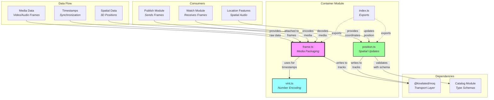
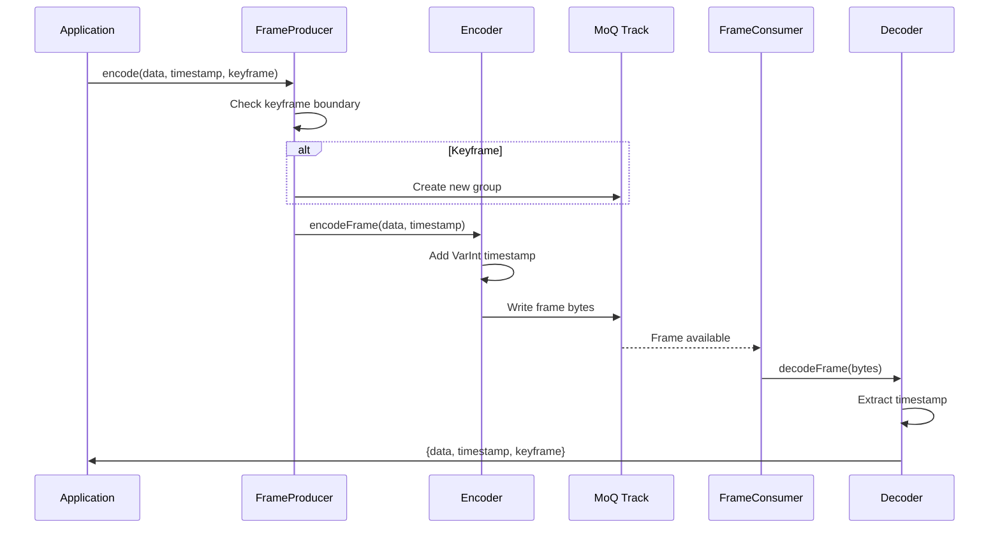
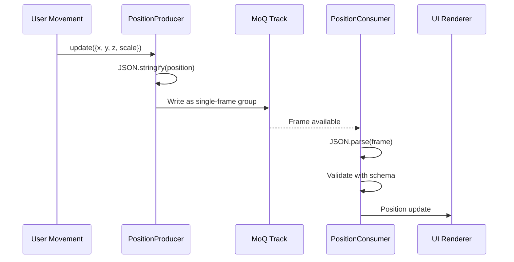

# Container Module Documentation

## Overview

The container module provides **data packaging formats** for media and metadata streams. It acts as the **serialization layer** that transforms JavaScript objects and media frames into wire-format bytes for transmission over MoQ tracks. Think of it as the **data envelope** that wraps content with necessary metadata like timestamps before sending.

> 💡 **For Beginners: What's a "container" in media streaming?**
> 
> A container is like a shipping box for your data. Just as a shipping box has labels (address, weight), a media container adds metadata (timestamps, frame type) to raw video/audio data. This metadata helps receivers know when to play each frame and whether it's a keyframe (complete picture) or delta frame (just the changes).

## Purpose

The container module serves as the **data formatting layer**, enabling:
- **Frame timestamping** for media synchronization
- **Efficient encoding** using variable-length integers
- **Position updates** for spatial audio/video
- **Type-safe serialization** with validation
- **Keyframe management** for video streams

## File Descriptions

### `frame.ts` - Media Frame Container
**Achieves**: Packages media frames with timestamps and manages keyframe boundaries for efficient streaming.

The frame container provides:

#### **FrameSource Interface**
- **Memory efficiency** - Allows zero-copy operations via `copyTo()` method
- **Size tracking** - Provides `byteLength` property for buffer allocation
- **Flexible input** - Functions accept either raw `Uint8Array` or `FrameSource` objects

#### **Frame Encoding/Decoding**
- **`encodeFrame()`** - Prefixes frame data with variable-length timestamp
- **`decodeFrame()`** - Extracts timestamp and returns remaining data
- **Efficient packing** - Uses variable-length integers (1-8 bytes based on timestamp value)
- **Buffer management** - Pre-allocates exact size needed (8 bytes max for timestamp + data)

#### **Producer Pattern** 
The `FrameProducer` class manages:
- **Group boundaries** - Automatically creates new groups on keyframes via `appendGroup()`
- **Keyframe enforcement** - Throws error if stream doesn't start with keyframe
- **Sequential writing** - Frames written in order within groups
- **Self-consumption** - Can create a consumer via `consume()` method
- **Resource cleanup** - `close()` properly terminates track and group

> 💡 **For Beginners: What are "keyframes" and "groups"?**
> 
> - **Keyframes** (I-frames) are complete pictures that can be decoded independently. Like a full photograph.
> - **Delta frames** (P/B-frames) only contain changes from previous frames. Like saying "move the red ball 5 pixels left."
> - **Groups** are sequences starting with a keyframe followed by delta frames. New viewers can only start watching at group boundaries (keyframes), which is why they're critical for streaming.

#### **Consumer Pattern**
The `FrameConsumer` class provides:
- **Async decoding** - `decode()` returns frames as they arrive
- **Timestamp extraction** - Uses `decodeFrame()` to get timing data
- **Keyframe detection** - Checks if `frame === 0` (first frame in group)
- **Complete frame data** - Returns `{data, timestamp, keyframe}` object
- **End-of-stream** - Returns `undefined` when no more frames

### `position.ts` - Spatial Location Container
**Achieves**: Serializes and transmits spatial positioning data for multi-user environments.

The position container enables:

#### **Position Updates**
- **Catalog integration** - Uses `Catalog.Position` type from catalog module
- **JSON serialization** - TextEncoder/Decoder for string conversion (developer TODO in code: binary format)
- **Schema validation** - `PositionSchema.parse()` ensures data integrity
- **Single-frame groups** - Each position update is its own group for immediate delivery

#### **Producer/Consumer Classes**
- **PositionProducer**:
  - `update(position)` - Sends new position as single-frame group
  - Creates new group per update for low latency
  - Immediately closes group after writing
- **PositionConsumer**:
  - `next()` - Async method returns validated position or undefined
  - Automatic JSON parsing and schema validation
  - Type-safe `Catalog.Position` return type

### `vint.ts` - Variable Integer Encoding
**Achieves**: Implements QUIC variable-length integer encoding for efficient number serialization.

The variable integer system provides:

#### **Space-Efficient Encoding**
- **Dynamic sizing** - Uses 1, 2, 4, or 8 bytes based on value size
- **Range constants**:
  - `MAX_U6`: 63 (2^6 - 1) → 1 byte encoding
  - `MAX_U14`: 16,383 (2^14 - 1) → 2 bytes
  - `MAX_U30`: 1,073,741,823 (2^30 - 1) → 4 bytes
  - `MAX_U53`: Number.MAX_SAFE_INTEGER → 8 bytes

#### **Functions**
- **`getVint53(buf)`** - Reads variable integer, returns `[value, remainingBuffer]`
- **`setVint53(dst, v)`** - Writes variable integer, returns used buffer slice
- **DataView usage** - Handles endianness correctly for multi-byte values
- **BigInt for 8-byte** - Uses BigInt for 53-bit values to maintain precision

> 💡 **For Beginners: What's "variable-length integer encoding"?**
> 
> Instead of always using 8 bytes for numbers (like standard JavaScript), variable-length encoding uses fewer bytes for smaller numbers:
> - Numbers 0-63 only need 1 byte (saving 7 bytes!)
> - Numbers up to 16,383 need 2 bytes
> - The first 2 bits tell you how many bytes to read (00=1, 01=2, 10=4, 11=8)
> - This is crucial for streaming where every byte counts for performance

### `index.ts` - Module Exports
**Achieves**: Provides clean export interface for container functionality.

Exports:
- **Frame module** - All exports from `./frame` (FrameSource, encode/decode functions, Producer/Consumer classes)
- **Position module** - All exports from `./position` (PositionProducer, PositionConsumer)
- **Not exported** - vint remains internal implementation detail

## Architectural Relationships



> 💡 **For Beginners: Reading this diagram**
> 
> - **Solid arrows** show data flow and dependencies
> - **Dotted arrows** show what's exported/made public
> - **Colors** indicate importance: pink (frame) is core, blue (vint) is utility, green (position) is feature
> - **Subgraphs** group related components together

## Data Flow Patterns

### Media Frame Flow


### Position Update Flow


## Key Design Principles

1. **Declarative Schemas**: Position data follows Catalog schemas for validation
2. **Efficient Encoding**: Variable-length integers minimize bandwidth
3. **Stream Orientation**: Frames flow through tracks as ordered sequences
4. **Keyframe Boundaries**: Video groups always start with keyframes
5. **Type Safety**: Schema validation ensures data integrity

> 💡 **For Beginners: Understanding these principles**
> 
> - **Stream orientation** means data arrives continuously over time, not all at once
> - **Bandwidth** is how much data you can send per second - minimizing it means faster streaming
> - **Schema validation** checks that incoming data matches expected format, preventing crashes from bad data
> - **Ordered sequences** ensure frames play in the right order - imagine a flipbook with pages mixed up!

## Frame Format Details

### Encoded Frame Structure
```
[VarInt Timestamp][Raw Frame Data]
```
- **Timestamp**: 1-8 bytes depending on value
- **Frame Data**: Remaining bytes are the actual media content

### Variable Integer Format
```
First 2 bits indicate length:
00: 1 byte  (6-bit value, range: 0-63)
01: 2 bytes (14-bit value, range: 0-16,383)  
10: 4 bytes (30-bit value, range: 0-1,073,741,823)
11: 8 bytes (53-bit value, range: 0-9,007,199,254,740,991)
```

> 💡 **For Beginners: How to read the prefix bits**
> 
> When you receive a byte like `01001010`:
> - First 2 bits are `01` = 2-byte integer follows
> - Remaining bits plus next byte form the actual value
> - This QUIC standard is used throughout the protocol for efficiency

## Usage Patterns

### Publishing Media Frames
1. **Create FrameProducer** with a MoQ track
2. **Encode frames** with timestamps and keyframe flags
3. **Groups created** automatically on keyframes
4. **Frames written** sequentially within groups
5. **Close producer** when stream ends

### Consuming Media Frames
1. **Create FrameConsumer** from track
2. **Decode frames** asynchronously as available
3. **Extract timestamps** for synchronization
4. **Detect keyframes** from frame position (0 = keyframe)
5. **Process media** data with appropriate decoder

### Position Updates
1. **Create PositionProducer** with dedicated track
2. **Send updates** as position changes
3. **Consumer receives** and validates positions
4. **UI updates** based on spatial data

## Performance Considerations

- **VarInt efficiency**: Saves bytes for small timestamps (common case)
- **Keyframe grouping**: Enables seeking and late-joining
- **JSON overhead**: Position updates use JSON (developer TODO in code: binary format)
- **Memory efficiency**: FrameSource interface avoids copies via `copyTo()` method
- **Buffer pre-allocation**: Exact size calculation prevents reallocation

> 💡 **For Beginners: Why performance matters**
> 
> - **Late-joining**: Users can start watching mid-stream by jumping to the next keyframe
> - **Seeking**: Skipping forward/backward in video by jumping between keyframes
> - **Zero-copy**: Moving data without duplicating it in memory - like handing someone a book instead of photocopying it
> - **Buffer reallocation**: Growing arrays is expensive - better to know the size upfront

## Future Improvements

- **Binary position format**: Replace JSON with efficient binary encoding
- **Compression**: Consider frame-level compression options
- **Batch updates**: Multiple positions in single frame
- **Delta encoding**: Send position changes instead of absolute values