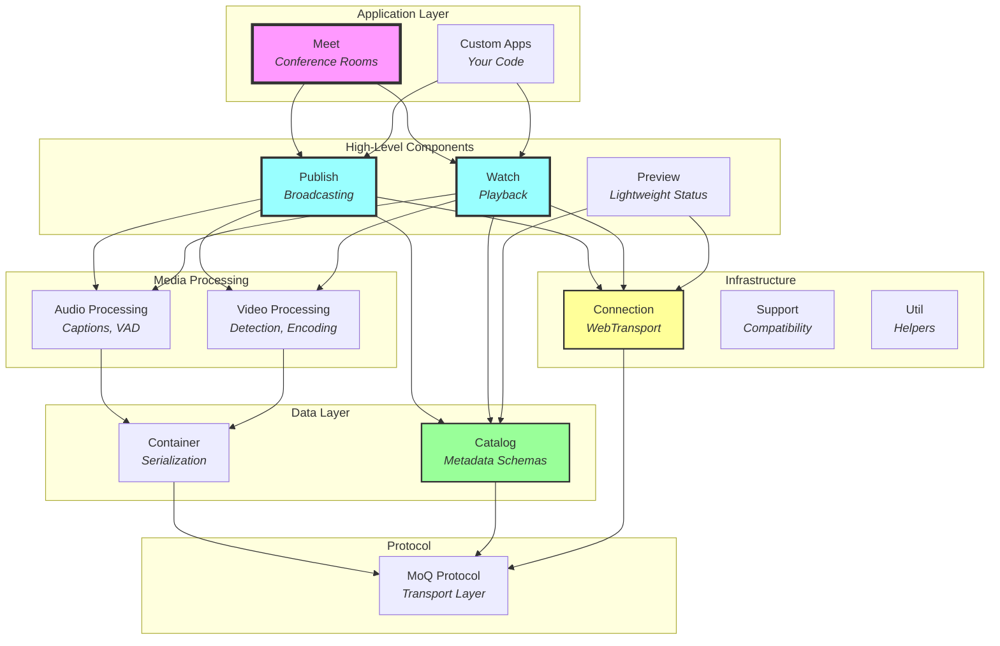
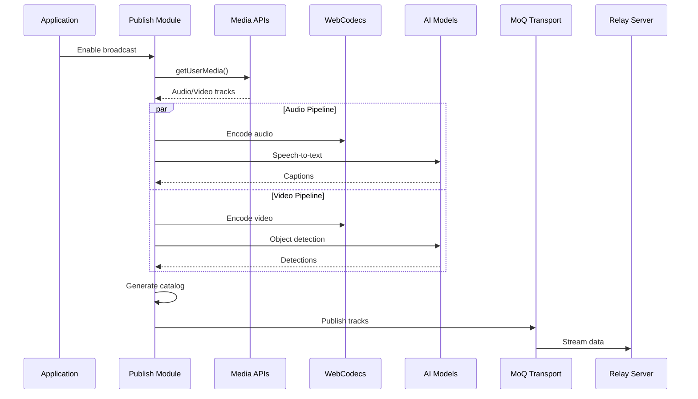
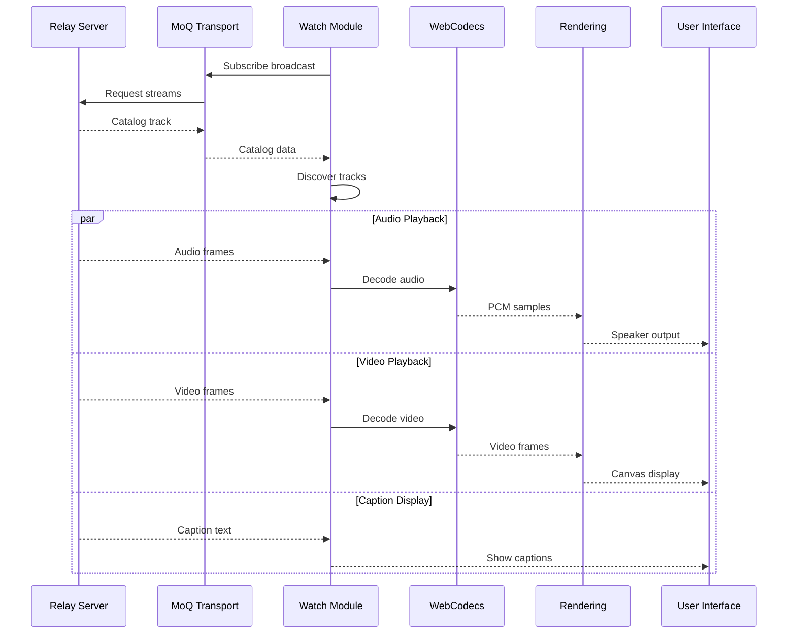
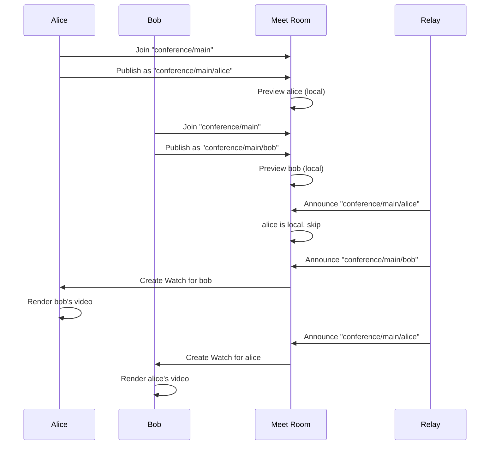

# Hang Library - Complete System Architecture

## Executive Overview

The Hang library is a **comprehensive real-time streaming framework** built on the MoQ (Media over QUIC) protocol. It provides everything needed to create live streaming applications, from simple broadcasts to complex multi-participant conferences, with built-in AI capabilities for captions and object detection. Think of it as a **complete toolkit for building the next generation of video communication platforms**.

> 💡 **For React Developers: MoQ vs WebRTC**
> 
> If you've used WebRTC for video calls, MoQ is the next evolution. While WebRTC was designed for peer-to-peer connections (complex NAT traversal, STUN/TURN servers), MoQ uses HTTP/3's transport layer (QUIC) to work more like a CDN. This means:
> - Works through corporate firewalls (uses standard HTTPS ports)
> - Scales better (relay servers can cache content like a CDN)
> - Lower latency (QUIC has better congestion control than WebRTC)
> - Simpler deployment (no STUN/TURN complexity)

> 💡 **For Beginners: What is Hang?**
> 
> Hang is like having all the building blocks of Zoom, Twitch, and Discord in one library. It handles the complex parts of real-time streaming (capturing video, encoding, network transport, decoding, playback) while giving you simple APIs to build your own unique experiences. Whether you want to build a streaming platform, video conferencing app, or spatial audio experience, Hang provides the foundation.

## System Philosophy

Hang follows a **declarative, reactive architecture** where:
- **You describe what you want** (connect to this server, broadcast this media)
- **The system handles how** (network protocols, codec selection, buffering)
- **Everything updates automatically** (UI reacts to connection changes, new participants)
- **AI runs on-device** (privacy-preserving captions and object detection)

## Architectural Layers

The system is organized into distinct layers, each building upon the previous:



## Core Concepts

### 1. Broadcasts - The Content Channel
A **broadcast** is a collection of synchronized tracks (video, audio, captions, chat) that together form a complete stream. Like a TV channel, viewers can tune in to receive all or some of the tracks.

### 2. Tracks - The Data Streams
**Tracks** are individual streams of data within a broadcast:
- `video.h264` - Encoded video frames
- `audio.opus` - Encoded audio samples
- `captions.json` - Speech-to-text output
- `chat.md` - Text messages
- `location.json` - Spatial position updates
- `detection.json` - Object detection results
- `catalog.json` - Metadata describing all tracks

> 💡 **For React Developers: What are codecs like H.264 and Opus?**
> 
> Codecs compress media to use less bandwidth. Raw video is huge (1080p = ~1.5 Gbps), but H.264 compresses it to ~5 Mbps. Think of it like image formats:
> - **H.264** (video) = Like JPEG for video - widely supported, good quality
> - **Opus** (audio) = Like MP3 but better - designed for real-time voice
> - The browser handles encoding/decoding via WebCodecs API (like how Canvas API handles images)

### 3. Groups and Frames - The Data Units
- **Groups** start with keyframes, allowing new viewers to join
- **Frames** are individual pieces of data with timestamps
- Groups enable seeking and late-joining in streams

### 4. Signals and Effects - The Reactive System
- **Signals** are reactive values that trigger updates when changed
- **Effects** are functions that run when signals change
- This creates automatic UI updates without manual event handling

## Module Deep Dive

### Foundation Layer

#### Connection Module
**Achieves**: Resilient WebTransport connectivity with automatic reconnection.
- Exponential backoff retry strategy with `Math.min(delay * 2, 30000)` capping at 30s
- Status signals for UI feedback (`connecting` | `connected` | `disconnected`)
- Single connection shared across all components via dependency injection
- Automatic cleanup and reconnection on failures

#### Support Module  
**Achieves**: Browser capability detection and compatibility checking.
- Tests for WebTransport, WebCodecs, AudioWorklet, MediaStreamTrackProcessor support
- Hardware vs software acceleration detection (returns `undefined` on Firefox)
- Returns `Full` type with detailed capability breakdown
- Web Component `<hang-support>` for visual status display
- Prevents runtime failures from missing APIs

#### Util Module
**Achieves**: Internal helper functions for common operations.
- Browser detection via `isChrome` and `isFirefox` constants (user agent based)
- Hex encoding/decoding with `toBytes()`/`fromBytes()` for codec descriptions
- Handles "0x" prefix transparently
- Pure functions with no side effects

### Data Layer

#### Catalog Module
**Achieves**: Type-safe metadata schemas for broadcast content.
- Root schema aggregates all metadata (video[], audio[], user, location, etc.)
- WebCodecs-compatible configs with codec strings (e.g., "avc1.640028" for H.264)
- Zod schemas with runtime validation and TypeScript inference
- JSON encoding/decoding via `encode()`/`decode()` functions
- Branded integer types (`u8` for priorities, `u53` for safe integers)

#### Container Module
**Achieves**: Efficient data serialization for streaming.
- Frame packaging with timestamps
- Variable-length integer encoding (QUIC standard)
- Position updates for spatial features
- Keyframe boundary management

### Media Processing Layer

#### Audio Subsystem (in Publish/Watch)
**Publishing Pipeline**:
1. Capture via MediaStream API
2. Process through AudioWorklet (low latency)
3. Encode with Opus codec
4. Generate captions with Whisper AI
5. Detect voice activity with Silero VAD

**Playback Pipeline**:
1. Receive encoded frames
2. Decode with WebCodecs
3. Buffer in circular buffer (AudioWorklet)
4. Smooth volume transitions
5. Display synchronized captions

#### Video Subsystem (in Publish/Watch)
**Publishing Pipeline**:
1. Capture from camera/screen
2. Intelligent codec selection (hardware priority)
3. Adaptive bitrate encoding
4. Object detection with YOLO AI
5. GOP management (2-second keyframes)

**Playback Pipeline**:
1. Receive encoded chunks
2. Decode with WebCodecs
3. Frame buffering (current + next)
4. Canvas rendering with RAF
5. Visibility-aware optimization

### Application Layer

#### Publish Module
**Achieves**: Complete broadcasting system with all media types.
- Orchestrates audio, video, captions, detection
- Device management (camera vs screen)
- Automatic permission handling
- Catalog generation and updates
- Web component: `<hang-publish>`

#### Watch Module
**Achieves**: Complete playback system with synchronization.
- Automatic track discovery via catalog
- Adaptive quality support
- Live/offline status tracking
- Visibility-aware downloads
- Web component: `<hang-watch>`

#### Preview Module
**Achieves**: Lightweight presence broadcasting.
- Minimal bandwidth usage (JSON only)
- Real-time status updates (speaking, available tracks)
- Room browsing before committing to streams
- Essential for scalable discovery

#### Meet Module
**Achieves**: Multi-participant conference rooms.
- Namespace-based room discovery
- Local/remote broadcast distinction
- Preview optimization (no self-echo)
- Dynamic participant management
- Web component: `<hang-meet>`

## Data Flow Patterns

### Broadcasting Flow


### Watching Flow


### Conference Room Flow


## Key Design Principles

### 1. Declarative Configuration
You describe the desired outcome, not the implementation:
```typescript
// Declarative: "I want to broadcast with camera"
const broadcast = new Publish.Broadcast(connection, {
  device: "camera",
  audio: { enabled: true },
  video: { enabled: true }
});

// Not imperative: "Open camera, create encoder, configure codec..."
```

### 2. Reactive State Management
Changes propagate automatically through signals:
```typescript
// When connection status changes, UI updates automatically
connection.status.subscribe(status => {
  statusIndicator.textContent = status;
});
```

### 3. Privacy-Preserving AI
All AI processing happens on-device:
- Speech-to-text never leaves your browser
- Object detection runs in local web workers
- No cloud services required

### 4. Progressive Enhancement
Core functionality works everywhere, advanced features when available:
- Basic: Audio/video streaming
- Enhanced: Hardware acceleration
- Advanced: AI captions and detection

### 5. Efficient Resource Management
- Visibility-aware: Pauses downloads when tab hidden
- Lazy loading: Only downloads what's needed
- Automatic cleanup: Prevents memory leaks

## Usage Patterns

### Simple Broadcast
```typescript
import { Connection, Publish } from "@kixelated/hang";

const connection = new Connection({
  url: new URL("wss://relay.example.com")
});

const broadcast = new Publish.Broadcast(connection, {
  name: "my-stream",
  device: "camera",
  audio: { 
    enabled: true,
    captions: { enabled: true }  // AI captions
  },
  video: { 
    enabled: true,
    detection: { enabled: true }  // Object detection
  }
});
```

### Simple Viewer
```typescript
import { Connection, Watch } from "@kixelated/hang";

const connection = new Connection({
  url: new URL("wss://relay.example.com")
});

const viewer = new Watch.Broadcast(connection, {
  name: "my-stream",
  enabled: true
});

// Render video
const renderer = new Watch.VideoRenderer(viewer.video, {
  canvas: document.querySelector("canvas")
});

// Play audio
const audio = new Watch.AudioEmitter(viewer.audio);
```

### Conference Room
```html
<hang-meet url="wss://relay.example.com" name="conference/room-123">
  <hang-publish 
    name="conference/room-123/alice" 
    device="camera"
    audio
    video />
</hang-meet>
```

### React Integration
```jsx
function StreamingApp() {
  const [connection] = useState(() => 
    new Connection({ url: new URL(RELAY_URL) })
  );
  
  const [broadcast] = useState(() => 
    new Publish.Broadcast(connection, {
      name: "my-stream",
      audio: { enabled: true },
      video: { enabled: true }
    })
  );
  
  useEffect(() => {
    return () => {
      broadcast.close();
      connection.close();
    };
  }, []);
  
  return <VideoPreview broadcast={broadcast} />;
}
```

## Performance Characteristics

### Latency Profile
- **Network**: ~50-200ms (WebTransport/QUIC)
- **Audio Buffer**: 100ms default (configurable)
- **Video GOP**: 2 seconds (keyframe interval)
- **AI Processing**: 100-500ms (model dependent)
- **Total E2E**: ~200-500ms typical

### Resource Usage
- **Bandwidth**: Adaptive (0.5-5 Mbps per stream)
- **CPU**: Moderate (encoding/decoding)
- **Memory**: ~50-200MB (includes AI models)
- **GPU**: Optional (WebGPU acceleration)

### Scalability
- **Participants**: Limited by browser (typically 10-25)
- **Viewers**: Unlimited (via relay infrastructure)
- **Tracks**: Flexible (audio, video, data)
- **Quality**: Adaptive based on network

## Browser Compatibility

### Required APIs
- **WebTransport** - Core networking (Chrome 97+, Edge 97+)
- **WebCodecs** - Media processing (Chrome 94+, Edge 94+)
- **AudioWorklet** - Low-latency audio (All modern browsers)
- **Custom Elements** - Web components (All modern browsers)

### Progressive Features
- **MediaStreamTrackProcessor** - Efficient video (Chrome 94+)
- **WebGPU** - AI acceleration (Chrome 113+)
- **SharedArrayBuffer** - Future optimizations

### Fallbacks
- Canvas-based video capture for Firefox
- Software codecs when hardware unavailable
- Disabled AI features on low-end devices

## Security & Privacy

### Built-in Protections
- **On-device AI** - No cloud dependencies
- **Permission handling** - Explicit user consent
- **Secure transport** - TLS 1.3 via QUIC
- **No tracking** - Privacy by design

### Best Practices
- Always use HTTPS origins
- Handle permissions gracefully
- Validate all incoming data
- Clean up resources properly

## Common Patterns

### Adaptive Quality
```typescript
// Monitor catalog for quality options
broadcast.catalog.subscribe(catalog => {
  const videos = catalog?.video || [];
  // Switch quality based on bandwidth
  selectOptimalQuality(videos);
});
```

### Speaker Detection
```typescript
// Highlight active speaker
broadcast.audio.captions.speaking.subscribe(speaking => {
  if (speaking) {
    highlightSpeaker(broadcast.name);
  }
});
```

### Spatial Audio
```typescript
// Position participants in 3D space
broadcast.location.current.subscribe(position => {
  updateSpatialAudio(position);
  render3DAvatar(position);
});
```

## Debugging Guide

### Connection Issues
```typescript
// Monitor connection state
connection.status.subscribe(console.log);

// Check WebTransport support
const support = new Support.Detector();
console.log("Supported:", support.supported);
```

### Media Problems
```typescript
// Check catalog
broadcast.catalog.subscribe(catalog => {
  console.log("Available tracks:", catalog);
});

// Monitor frame updates
video.frame.subscribe(frame => {
  console.log("New frame:", frame);
});
```

### Performance Monitoring
```typescript
// Audio buffer health
console.log("Buffered:", audio.buffered);

// Video frame rate
let frames = 0;
video.frame.subscribe(() => frames++);
setInterval(() => {
  console.log("FPS:", frames);
  frames = 0;
}, 1000);
```

## Future Roadmap

### Near Term
- Simulcast for adaptive bitrate
- E2E encryption for privacy
- Recording capabilities
- Enhanced mobile support

### Long Term
- WebRTC interoperability
- Server-side rendering
- AI video filters
- Metaverse integration

## Conclusion

The Hang library represents a **complete reimagining of real-time communication** for the web. By combining:
- Modern protocols (QUIC/WebTransport)
- Efficient codecs (WebCodecs)
- On-device AI (Transformers.js)
- Reactive programming (Signals)
- Web standards (Custom Elements)

It provides developers with a **powerful, privacy-preserving platform** for building the next generation of streaming applications. Whether you're creating a simple broadcast, a complex conference system, or exploring new forms of real-time interaction, Hang provides the foundation to build upon.

The declarative, reactive architecture means you can **focus on your application's unique value** rather than wrestling with low-level streaming complexities. The future of real-time communication is here, and it's built on open standards, respects privacy, and puts developers in control.