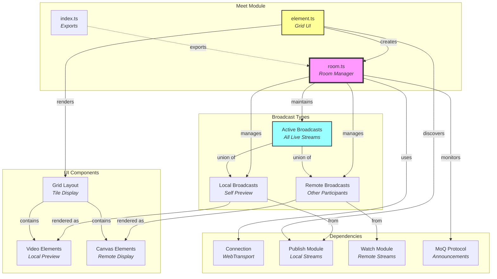
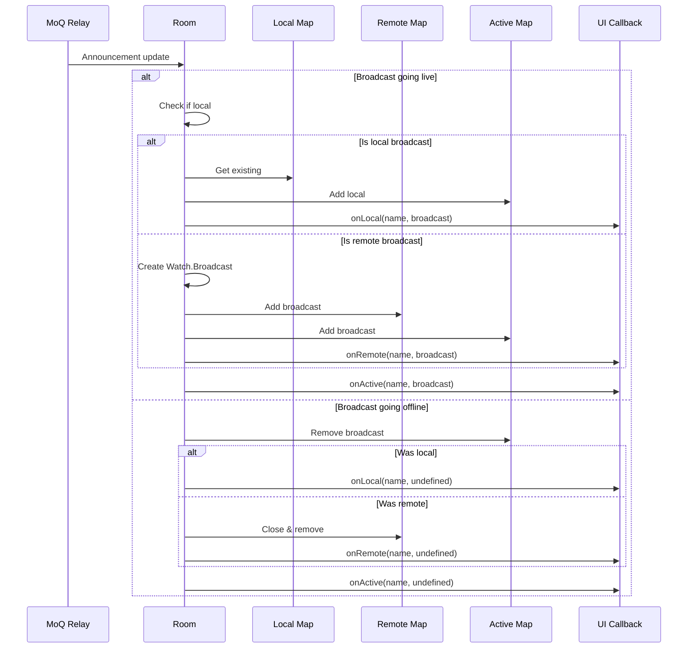
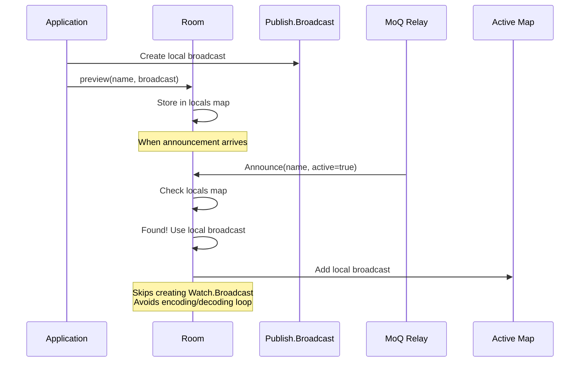
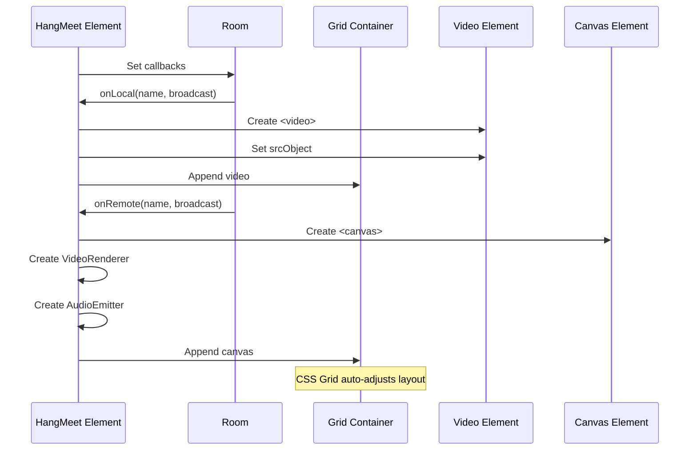

# Meet Module Documentation

## Overview

The meet module provides a **multi-participant conference room** system that dynamically manages multiple broadcasts in a shared namespace. It automatically discovers active broadcasts, distinguishes between local and remote participants, and provides a unified interface for building video conferencing applications. Think of it as the **conference orchestrator** that creates virtual rooms where multiple users can publish and watch each other's streams simultaneously.

> 💡 **For Beginners: What's a "meet" room?**
> 
> A meet room is like a virtual conference room where multiple people can join, each potentially broadcasting their own audio/video while watching others. The room automatically discovers who's broadcasting and manages the connections, similar to Zoom or Google Meet but using the MoQ protocol.

## Purpose

The meet module serves as the **conference management layer**, enabling:
- **Automatic broadcast discovery** via namespace monitoring
- **Local/remote distinction** to avoid self-echo
- **Dynamic participant management** with join/leave events
- **Unified room interface** for all broadcasts in a namespace
- **Preview capability** for local broadcasts without round-trip
- **Grid layout rendering** via web component
- **Callback-based updates** for efficient UI integration

## File Descriptions

### `room.ts` - Conference Room Manager
**Achieves**: Orchestrates multiple broadcasts within a shared namespace with automatic discovery and lifecycle management.

The Room class provides:

#### **Core Architecture**
- **Namespace Monitoring** - Watches for broadcasts with a common prefix
- **Broadcast Collections** - Maintains separate maps for active, remote, and local
- **Dynamic Discovery** - Automatically adds/removes broadcasts as they go live/offline
- **Preview System** - Renders local broadcasts without network round-trip
- **Callback Pattern** - Avoids re-rendering entire UI on each change

#### **Broadcast Collections**
Three synchronized maps track broadcasts:
1. **`active`** - All currently live broadcasts (local + remote)
2. **`remotes`** - Remote broadcasts from other participants
3. **`locals`** - Local broadcasts (avoids self-echo)

#### **Discovery Mechanism**
```
1. Monitor announced broadcasts with namespace prefix
2. Check if broadcast is local (preview)
3. If local: Use existing Publish.Broadcast
4. If remote: Create new Watch.Broadcast
5. Update appropriate collections
6. Fire callbacks for UI updates
```

#### **Preview System**
Allows rendering local broadcasts without network round-trip:
- **`preview(name, broadcast)`** - Register local broadcast
- **`unpreview(name)`** - Remove local broadcast
- **Automatic handling** - Skips creating Watch for previewed broadcasts
- **Performance benefit** - No encoding/decoding for self-view

#### **Callback System**
Three callback types for granular updates:
- **`onActive`** - Any broadcast added/removed
- **`onRemote`** - Remote participant changes
- **`onLocal`** - Local broadcast changes

Callbacks avoid signals to prevent full re-renders on each participant change.

#### **Key Features**
- **Automatic cleanup** - Closes broadcasts when room closes
- **Lazy initialization** - Remote broadcasts created with `enabled: false`
- **Namespace filtering** - Only monitors broadcasts with matching prefix
- **Error handling** - Graceful handling of missing broadcasts

### `element.ts` - Conference Grid Web Component
**Achieves**: Provides a ready-to-use HTML element that renders a conference room as a responsive grid of video tiles.

The `<hang-meet>` element offers:

#### **HTML Interface**
```html
<hang-meet url="wss://relay.example.com" name="conference/room-123">
  <!-- Nested publish elements become local broadcasts -->
  <hang-publish name="conference/room-123/alice" device="camera" audio video />
</hang-meet>
```

#### **Attributes**
- `url` - WebTransport relay endpoint
- `name` - Room namespace prefix

#### **Grid Layout**
- **Responsive Grid** - Uses CSS Grid with auto-fit
- **Minimum Tile Size** - 200px minimum width
- **Automatic Scaling** - Adjusts to number of participants
- **Gap Spacing** - 10px between tiles

#### **Local Broadcast Integration**
Automatically discovers nested `<hang-publish>` elements:
1. Finds child `hang-publish` elements
2. Monitors their broadcast names
3. Registers them as previews
4. Shares connection URL

#### **Remote Broadcast Rendering**
For each remote participant:
1. Creates canvas element for video
2. Instantiates VideoRenderer for display
3. Creates AudioEmitter for playback
4. Enables download (`enabled: true`)
5. Adds to grid layout

#### **Resource Management**
- **Cleanup tracking** - Maps store renderers for disposal
- **Video elements** - Local broadcasts use `<video>`
- **Canvas elements** - Remote broadcasts use `<canvas>`
- **Proper disposal** - Closes renderers on removal

#### **Lifecycle Hooks**
- **`connectedCallback`** - Discovers local broadcasts
- **`disconnectedCallback`** - Cleans up effects
- **`attributeChangedCallback`** - Updates URL/name

### `index.ts` - Module Exports
**Achieves**: Provides clean public API by exporting only the Room class.

Simple re-export of the room functionality, keeping the web element as a separate import for tree-shaking.

## Architectural Relationships



> 💡 **For Beginners: Understanding the room concept**
> 
> - The room watches a namespace (like "conference/room-123")
> - Any broadcast starting with that prefix is part of the room
> - Local broadcasts are your own streams (camera/screen)
> - Remote broadcasts are other participants
> - The room automatically manages who's in and who's out

## Data Flow Patterns

### Room Discovery Flow


### Preview System Flow


### Grid Rendering Flow


## Key Design Principles

1. **Namespace-based Discovery** - Broadcasts grouped by prefix
2. **Preview Optimization** - Local streams bypass network
3. **Callback Efficiency** - Granular updates avoid re-renders
4. **Lazy Remote Loading** - Downloads start only when needed
5. **Automatic Lifecycle** - Cleanup on disconnect
6. **Separation of Concerns** - Room logic separate from UI

> 💡 **For Beginners: Why these principles matter**
> 
> - **Namespace discovery** means rooms are implicit - just use the same prefix
> - **Preview optimization** prevents echo and saves CPU
> - **Callbacks** mean adding one person doesn't redraw everyone
> - **Lazy loading** saves bandwidth until you actually need the stream

## Configuration Patterns

### Basic Room Setup
```typescript
const connection = new Connection(url);
const room = new Room(connection, {
  name: "conference/main"
});

// React to participants
room.onActive((name, broadcast) => {
  if (broadcast) {
    console.log(`${name} joined`);
  } else {
    console.log(`${name} left`);
  }
});
```

### With Local Publishing
```typescript
// Create local broadcast
const myBroadcast = new Publish.Broadcast(connection, {
  name: "conference/main/alice",
  device: "camera",
  audio: { enabled: true },
  video: { enabled: true }
});

// Register as preview
room.preview("conference/main/alice", myBroadcast);
```

### HTML Conference Grid
```html
<hang-meet url="wss://relay.example.com" name="conference/room-123">
  <!-- Local participant -->
  <hang-publish 
    name="conference/room-123/me" 
    device="camera"
    audio
    video
    controls />
</hang-meet>
```

### Custom UI Integration
```typescript
const room = new Room(connection);

// Custom rendering for each participant
room.onRemote((name, broadcast) => {
  if (broadcast) {
    const tile = createVideoTile(name);
    const renderer = new Watch.VideoRenderer(broadcast.video, {
      canvas: tile.canvas
    });
    tiles.set(name, { tile, renderer });
  } else {
    const { tile, renderer } = tiles.get(name);
    renderer.close();
    tile.remove();
    tiles.delete(name);
  }
});
```

## Performance Considerations

- **Preview Bypass** - Local streams skip encoding/decoding
- **Lazy Downloads** - Remote streams created with `enabled: false`
- **Callback Pattern** - Avoids full UI re-renders
- **Grid Layout** - CSS Grid handles responsive layout
- **Resource Cleanup** - Proper disposal prevents leaks

## Browser Compatibility

### Required APIs
- **WebTransport** - For MoQ protocol
- **Custom Elements** - For web component
- **CSS Grid** - For layout
- **MediaStream** - For local preview
- **Canvas 2D** - For remote rendering

### Known Limitations
- **Participant Limit** - Browser may struggle with many streams
- **Grid Performance** - Too many tiles impacts rendering
- **Memory Usage** - Each stream consumes resources

## Usage Patterns

### Conference Application
```typescript
class ConferenceApp {
  room: Room;
  
  constructor(url: URL, roomName: string) {
    const connection = new Connection(url);
    this.room = new Room(connection, {
      name: `conference/${roomName}`
    });
    
    this.setupCallbacks();
    this.publishLocal();
  }
  
  setupCallbacks() {
    this.room.onActive((name, broadcast) => {
      this.updateParticipantList();
      this.updateGridLayout();
    });
  }
  
  publishLocal() {
    const broadcast = new Publish.Broadcast(this.connection, {
      name: `conference/${roomName}/${userId}`,
      device: "camera"
    });
    
    this.room.preview(broadcast.name, broadcast);
  }
}
```

### React Integration
```jsx
function ConferenceRoom({ roomId }) {
  const elementRef = useRef();
  
  useEffect(() => {
    const element = elementRef.current;
    element.url = "wss://relay.example.com";
    element.name = `conference/${roomId}`;
    
    return () => {
      // Cleanup handled by element
    };
  }, [roomId]);
  
  return (
    <hang-meet ref={elementRef}>
      <hang-publish 
        name={`conference/${roomId}/${userId}`}
        device="camera"
        audio
        video />
    </hang-meet>
  );
}
```

### Dynamic Room Management
```typescript
// Switch between rooms
function switchRoom(newRoomName: string) {
  room.name.set(newRoomName);
  // Room automatically updates announcements
}

// Mute all remote audio
room.onRemote((name, broadcast) => {
  if (broadcast) {
    broadcast.audio.enabled.set(false);
  }
});
```

## Best Practices

1. **Use Previews** - Always preview local broadcasts
2. **Namespace Convention** - Use hierarchical names (room/user)
3. **Lazy Enable** - Only enable needed remote streams
4. **Cleanup Callbacks** - Remove callbacks when done
5. **Error Handling** - Handle connection failures gracefully
6. **Resource Limits** - Consider maximum participants

## Common Patterns

### Selective Streaming
```typescript
// Only download video from active speaker
let activeSpeaker: string | undefined;

room.onRemote((name, broadcast) => {
  if (broadcast) {
    // Only enable active speaker's video
    broadcast.video.enabled.set(name === activeSpeaker);
    // Always get audio
    broadcast.audio.enabled.set(true);
  }
});
```

### Participant Limits
```typescript
const MAX_PARTICIPANTS = 25;

room.onActive((name, broadcast) => {
  if (broadcast && room.active.size > MAX_PARTICIPANTS) {
    // Show warning or prevent join
    console.warn("Room full");
  }
});
```

### Recording Integration
```typescript
// Record all participants
const recordings = new Map();

room.onActive((name, broadcast) => {
  if (broadcast && broadcast instanceof Watch.Broadcast) {
    const recorder = new MediaRecorder(/* ... */);
    recordings.set(name, recorder);
    recorder.start();
  } else if (!broadcast) {
    recordings.get(name)?.stop();
    recordings.delete(name);
  }
});
```

## Debugging Tips

1. **Check Namespace** - Ensure all participants use same prefix
2. **Monitor Callbacks** - Log all callback invocations
3. **Verify Previews** - Check locals map has your broadcast
4. **Track Collections** - Log sizes of active/remote/local maps
5. **Connection State** - Verify WebTransport is connected

## Common Issues

### Not Seeing Other Participants
```typescript
// Check namespace matches
console.log("Room namespace:", room.name.peek());
console.log("Active broadcasts:", room.active.size);

// Verify announcements are arriving
room.onActive((name, broadcast) => {
  console.log("Announcement:", name, !!broadcast);
});
```

### Self-Echo Problems
```typescript
// Ensure local broadcast is previewed
const localName = `${room.name.peek()}/${userId}`;
room.preview(localName, myBroadcast);

// Verify it's in locals map
console.log("Is previewed:", room.locals.has(localName));
```

### Grid Layout Issues
```javascript
// Check element is properly initialized
const meetElement = document.querySelector("hang-meet");
console.log("Room size:", meetElement.room.active.size);
console.log("Grid children:", meetElement.querySelector("div").children.length);
```

## Future Enhancements

- **Speaker Detection** - Highlight active speaker
- **Screen Share Priority** - Larger tile for screen shares  
- **Breakout Rooms** - Sub-namespaces for groups
- **Moderator Controls** - Mute/remove participants
- **Layout Options** - Gallery/speaker/spotlight views
- **Virtual Backgrounds** - Process video before publishing
- **Raise Hand** - Signaling through metadata track