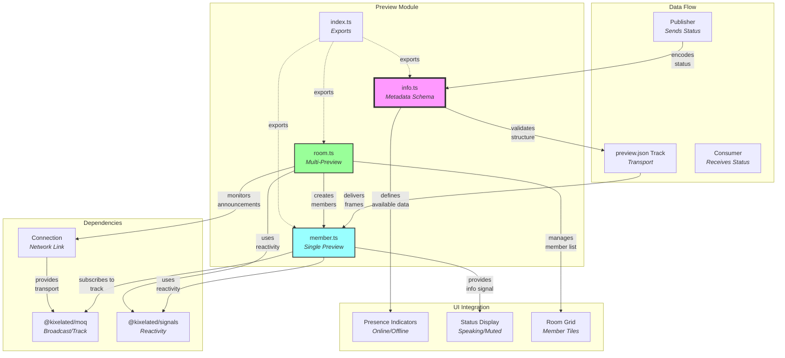
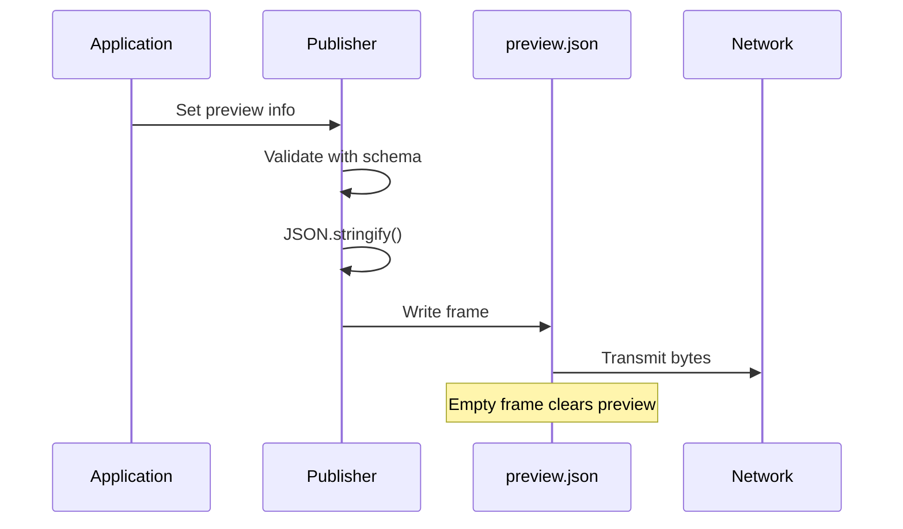
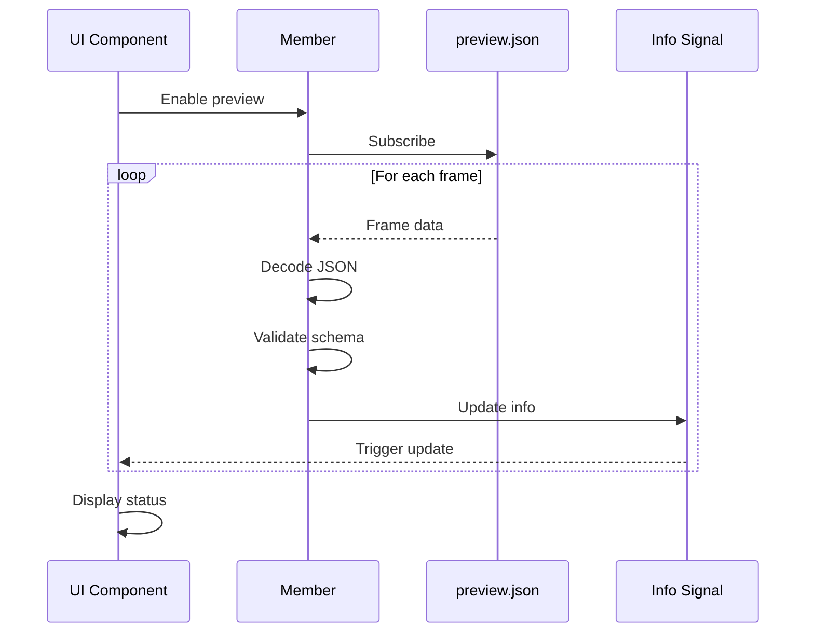
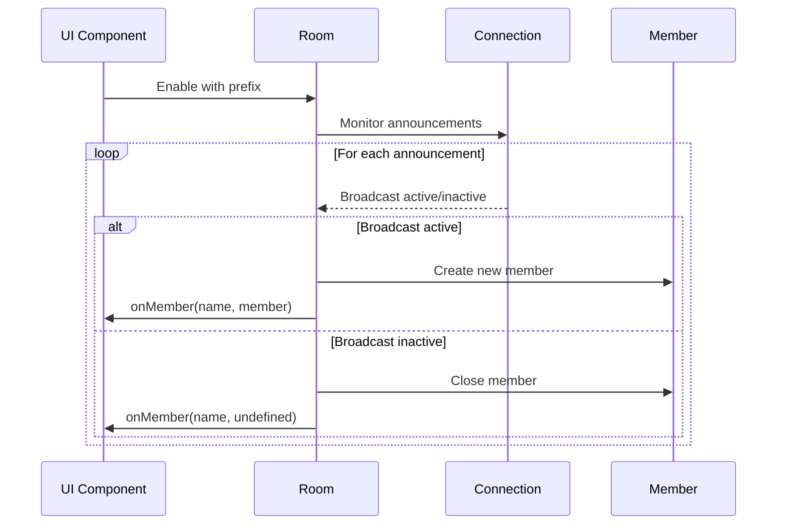

# Preview Module Documentation

## Overview

The preview module provides **lightweight metadata broadcasting** for media streams. It enables publishers to share real-time status information about their broadcast without requiring consumers to download the full media streams. Think of it as a **presence indicator** that tells others what content is available and its current state (e.g., "I have video and audio, and I'm currently speaking").

> 💡 **For Beginners: What's a "preview" in streaming?**
> 
> A preview is like a restaurant menu - it tells you what's available without requiring you to order everything. In streaming, previews let you see who's broadcasting and what content they have (video, audio, chat) without actually downloading their media streams. This saves bandwidth and lets you make informed choices about what to watch.

## Purpose

The preview module serves as a **bandwidth-efficient discovery mechanism**, enabling:
- **Stream availability** signaling without downloading media
- **Real-time status** updates (speaking indicators, active tracks)
- **User presence** information for UI display
- **Efficient room browsing** before committing to full streams
- **Dynamic UI updates** based on broadcaster state

## File Descriptions

### `info.ts` - Preview Metadata Schema
**Achieves**: Defines the structure of preview information that broadcasters share about their streams.

The Info schema provides:
- **Identity fields**:
  - `name` - Display name of the broadcaster
  - `avatar` - URL or identifier for profile image
- **Capability flags**:
  - `audio` - Whether audio track is available
  - `video` - Whether video track is available
  - `chat` - Whether chat functionality is enabled
- **Status indicators**:
  - `speaking` - Real-time speaking detection

Additional exports:
- **PreviewSchema** - Alias for InfoSchema (same structure)
- **Info type** - TypeScript type inferred from InfoSchema

All fields are optional via `.optional()`, allowing broadcasters to share only what they choose. The schema is intentionally lightweight to minimize bandwidth usage while providing essential presence information.

### `member.ts` - Individual Preview Consumer
**Achieves**: Manages the consumption and reactive updates of a single broadcaster's preview information.

The Member class provides:

#### **What It Does**
- **Monitors a single broadcast** - Consumes preview information from one specific broadcaster
- **Provides reactive updates** - UI components automatically update when preview data changes
- **Handles lifecycle** - Manages connection, data processing, and cleanup

#### **Why It Matters**
- **Bandwidth efficiency** - Get broadcaster status without downloading media streams
- **UI responsiveness** - Instant updates when someone starts/stops speaking or changes status
- **Resource safety** - Automatic cleanup prevents memory leaks and hanging connections

#### **How It Works**

**Class Properties:**
- `broadcast: Moq.BroadcastConsumer` - The broadcast to consume preview from
- `enabled: Signal<boolean>` - Reactive control for enabling/disabling (default: false)
- `info: Signal<Preview.Info | undefined>` - Reactive preview data signal
- `signals: Effect` - Effect system managing the reactive subscriptions

**Data Flow:**
- Subscribes to "preview.json" track at priority 0 when enabled
- Processes frames in async loop with `Promise.race()` for cancellation
- Empty frames (0 bytes) clear preview by setting info to undefined
- Non-empty frames decoded as JSON and validated against InfoSchema
- Cleanup in finally block ensures info cleared on any exit

**Configuration:**
- `MemberProps` type accepts optional `enabled` boolean
- Constructor initializes with broadcast consumer and optional props

> 💡 **For Beginners: What are "Signals" and "Effects"?**
> 
> - **Signals** are like React state but framework-agnostic - they hold values that trigger updates when changed
> - **Effects** are like React's useEffect - they run code when signals change and can clean up after themselves
> - This reactive pattern means UI automatically updates when preview data changes, without manual event listeners

### `room.ts` - Multi-Preview Manager
**Achieves**: Discovers and manages preview information for multiple broadcasters within a namespace.

The Room class provides:

#### **What It Does**
- **Discovers broadcasts automatically** - Monitors a namespace for any matching broadcasts
- **Manages multiple members** - Creates and destroys Member instances as needed
- **Coordinates state** - Synchronizes enabled/disabled state across all members

#### **Why It Matters**
- **Scalable discovery** - Handle rooms with many participants without manual tracking
- **Unified control** - Enable/disable all previews with one switch
- **Event-driven UI** - Callbacks notify when participants join or leave

#### **How It Works**

**Class Properties:**
- `connection: Connection` - Network connection for discovering broadcasts
- `name: Signal<Path.Valid | undefined>` - Namespace prefix to monitor
- `enabled: Signal<boolean>` - Control for starting/stopping discovery
- `#members: Map<Path.Valid, Member>` - Private map tracking active members
- `#onMember` - Optional callback for member add/remove events
- `#signals: Effect` - Effect system for reactive behavior

**Discovery Flow:**
- `#init` method runs when enabled and connection established
- Creates `announced()` consumer monitoring the namespace prefix
- `#runMembers` async loop processes announcement updates
- Uses `Promise.race()` pattern for clean cancellation

**Member Management:**
- `#handleUpdate` processes announcements:
  - Active: Creates Member with broadcast consumer, adds to map
  - Inactive: Closes existing Member, removes from map
- Members inherit room's enabled state via effect binding
- `onMember()` registration fires callback for existing members

**Configuration:**
- `RoomProps` accepts optional `name` and `enabled`
- Defaults to disabled state
- Constructor binds initialization to effect system

> 💡 **For Beginners: What's "namespace filtering" and "announcements"?**
> 
> - **Namespace** is like a folder path - broadcasts can be organized hierarchically (e.g., "room/alice", "room/bob")
> - **Announcements** are notifications when broadcasts start or stop - like "user joined/left" in a chat room
> - **Path.Valid** is a type-safe way to ensure paths are properly formatted (no invalid characters)
> - The Room watches for any broadcasts starting with your prefix, automatically managing them as they come and go

### `index.ts` - Module Exports
**Achieves**: Provides clean export interface for preview functionality.

Exports all from:
- **`./info`** - InfoSchema, PreviewSchema, Info type
- **`./member`** - Member class, MemberProps type
- **`./room`** - Room class, RoomProps type

## Architectural Relationships



> 💡 **For Beginners: How the preview system flows**
> 
> 1. **Publisher** creates preview data (name, video/audio flags, etc.)
> 2. **Schema** validates the data structure is correct
> 3. **Track** (preview.json) carries data over the network
> 4. **Member** receives and decodes the preview
> 5. **Signals** trigger UI updates automatically
> 6. **Room** manages multiple members at once
> 
> Think of it like a conference room where each person has a nameplate showing their status - the preview system keeps all nameplates updated in real-time.

## Data Flow

### Preview Publishing Flow


### Preview Consumption Flow


### Room Discovery Flow


## Key Design Principles

1. **Bandwidth Efficiency**: Preview data is minimal, avoiding full media download
2. **Real-time Updates**: Changes propagate immediately through reactive signals
3. **Graceful Degradation**: Missing preview doesn't break media consumption
4. **Schema Flexibility**: All fields optional for progressive enhancement
5. **Resource Management**: Automatic cleanup prevents memory leaks

> 💡 **For Beginners: Understanding these principles**
> 
> - **Graceful degradation** means the app still works even if some features fail - like a website that works without JavaScript
> - **Progressive enhancement** is adding features only when supported - start simple, add complexity as needed
> - **Memory leaks** happen when code forgets to clean up - like leaving lights on when you leave a room
> - **Reactive signals** automatically trigger updates - like Excel cells that recalculate when their inputs change

## Usage Patterns

### Publishing Preview Information
1. **Create preview track** named "preview.json"
2. **Construct Info object** with current status
3. **Serialize to JSON** and encode as bytes
4. **Write to track** as single-frame group
5. **Update as needed** when status changes

### Consuming Individual Preview
1. **Create Member** with broadcast consumer
2. **Enable consumption** to start receiving updates
3. **Subscribe to info signal** for reactive updates
4. **Display in UI** based on available fields
5. **Close when done** to free resources

### Managing Room of Previews
1. **Create Room** with connection and prefix
2. **Register onMember callback** for updates
3. **Enable room** to start discovery
4. **Handle member changes** in callback
5. **Update UI grid** as members join/leave

## Common Use Cases

### Speaking Indicator
```typescript
// React to speaking status using signal subscription
member.info.subscribe((info) => {
  if (info?.speaking) {
    showSpeakingIndicator();
  }
});
```

> 💡 **For Beginners: The ?. operator**
> 
> `info?.speaking` uses optional chaining - it safely accesses `speaking` only if `info` exists. Without the `?.`, accessing `speaking` on `undefined` would crash. It's like saying "if info exists, check speaking; otherwise return undefined".

### Capability Detection
```typescript
// Check what's available before subscribing
const info = member.info.peek();  // peek() gets current value without subscribing
if (info?.video) {
  // Subscribe to video track
}
if (info?.audio) {
  // Subscribe to audio track
}
```

> 💡 **For Beginners: peek() vs subscribe()**
> 
> - `peek()` gets the current value once, like checking the time
> - `subscribe()` watches for all future changes, like setting an alarm
> - Use peek() for one-time checks, subscribe() for ongoing updates

### Room Grid Display
```typescript
// Display all active members
room.onMember((name, member) => {
  if (member) {
    addToGrid(name, member.info);
  } else {
    removeFromGrid(name);
  }
});
```

## Performance Considerations

- **Lightweight protocol**: JSON previews are typically <100 bytes
- **No media decoding**: Avoids CPU-intensive operations
- **Selective subscription**: Only fetch previews when needed
- **Batched updates**: Room handles multiple members efficiently
- **Reactive efficiency**: Signals prevent unnecessary re-renders
- **Empty frame optimization**: Zero-byte frames clear state without parsing

> 💡 **For Beginners: Why performance matters here**
> 
> - **Media decoding** (video/audio processing) uses lots of CPU - previews skip this entirely
> - **Re-renders** are when UI redraws - signals only update what changed, not the whole screen
> - **<100 bytes** is tiny - a single emoji is 4 bytes, so preview data is like 20-25 characters
> - This efficiency means you can monitor hundreds of broadcasters without performance issues

## Integration Points

- **MoQ Transport**: Uses standard broadcast/track system
- **Catalog System**: Complements but doesn't require full catalog
- **UI Components**: Drives presence indicators and status displays
- **Publish Module**: Publishers send preview alongside media
- **Watch Module**: Consumers can check preview before full subscription

## Best Practices

1. **Keep previews small**: Include only essential information
2. **Update sparingly**: Avoid flooding with minor changes
3. **Handle missing data**: UI should work without preview
4. **Use empty frames**: Clear preview when going offline
5. **Validate strictly**: Protect against malformed data