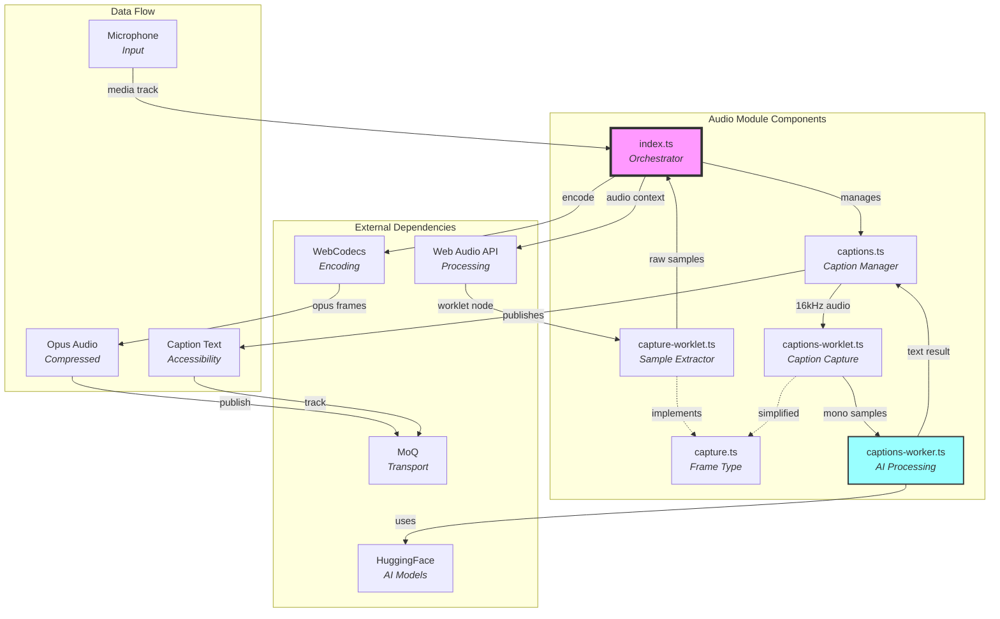
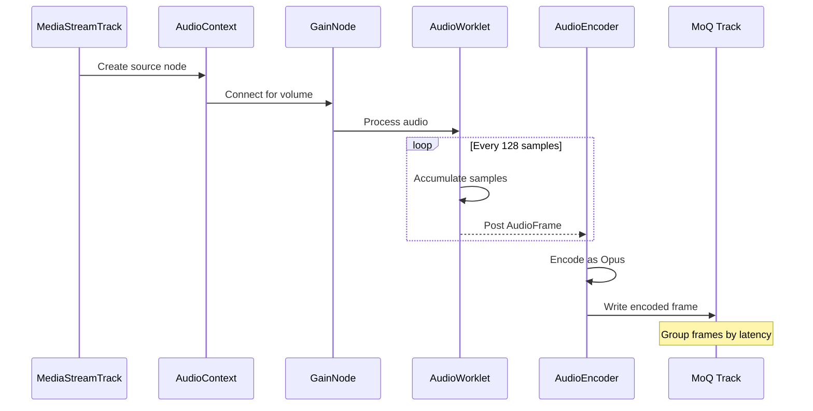
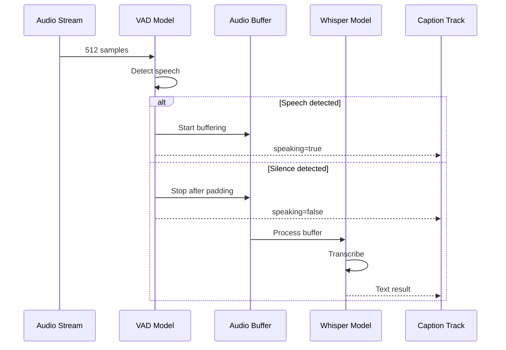

# Publish/Audio Module Documentation

## Overview

The publish/audio module provides **real-time audio capture, encoding, and streaming** capabilities. It captures audio from media tracks, processes it through Web Audio API worklets, encodes it using WebCodecs, and optionally generates captions using on-device AI models. Think of it as the **audio production pipeline** that transforms microphone input into streamable media with accessibility features.

## Purpose

The audio module serves as the **audio publishing layer**, enabling:
- **Audio capture** from microphone or screen share
- **Real-time encoding** using Opus codec
- **Volume control** with smooth transitions
- **Speech-to-text** caption generation
- **Voice activity detection** for speaking indicators
- **Low-latency streaming** with configurable group sizes

## File Descriptions

### `index.ts` - Audio Publishing Core
**Achieves**: Orchestrates the complete audio publishing pipeline from capture to transmission.

The Audio class provides:

#### **Core Components**
- **Media Management** - Accepts and processes AudioTrack inputs
- **Signal-based State** - Reactive properties for all configurations
- **Catalog Generation** - Creates metadata describing the audio stream
- **Broadcast Integration** - Publishes tracks to MoQ broadcast

#### **Audio Processing Pipeline**
1. **Source Creation** - Converts MediaStreamTrack to AudioContext nodes
2. **Gain Control** - Applies volume/mute with smooth transitions
3. **Worklet Capture** - Extracts raw audio samples via AudioWorkletNode
4. **Encoding** - Compresses audio using Opus codec
5. **Frame Packaging** - Wraps encoded data with timestamps
6. **Group Management** - Batches frames based on latency settings

#### **Configuration Properties**
- `enabled` - Whether to publish audio
- `media` - The AudioTrack to publish
- `constraints` - Media constraints for capture
- `muted` - Mute state (smooth fade)
- `volume` - Volume level (0-1)
- `maxLatency` - Maximum group duration (default 100ms)

#### **Key Features**
- **Smooth Gain Transitions** - Uses exponential ramps to avoid clicks
- **Dynamic Track Creation** - Generates new tracks as needed
- **Catalog Updates** - Publishes stream metadata
- **Caption Integration** - Optional speech-to-text support

### `capture.ts` - Audio Frame Interface
**Achieves**: Defines the data structure for raw audio frames passed between worklet and main thread.

Simple interface containing:
- `timestamp` - Sample position in the stream
- `channels` - Array of Float32Array buffers (one per channel)

### `capture-worklet.ts` - Audio Sample Extraction
**Achieves**: Runs in the audio thread to capture raw samples with minimal latency.

The Capture AudioWorkletProcessor:
- **Processes audio blocks** - Receives 128-sample chunks
- **Tracks sample position** - Maintains running timestamp
- **Posts to main thread** - Sends AudioFrame messages via port
- **Minimal processing** - Avoids blocking audio thread

### `captions.ts` - Caption Generation Manager
**Achieves**: Coordinates speech-to-text processing and caption track publishing.

The Captions class provides:

#### **Caption Pipeline**
1. **Audio Resampling** - Converts to 16kHz for AI model
2. **Worklet Setup** - Creates dedicated capture for captions
3. **Worker Communication** - Manages caption generation worker
4. **Track Publishing** - Streams captions as text track
5. **Signal Updates** - Publishes speaking/text states

#### **Configuration**
- `enabled` - Whether to generate captions
- `ttl` - Time-to-live for caption display (default 10s)

#### **Output Signals**
- `speaking` - Boolean indicating voice activity
- `text` - Current caption text
- `catalog` - Caption track metadata

### `captions-worklet.ts` - Caption Audio Capture
**Achieves**: Specialized worklet for capturing mono audio at specific sample rate for AI processing.

Simplified capture that:
- **Enforces mono** - Single channel only
- **Minimal processing** - Direct passthrough to worker
- **Optimized for AI** - Matches model requirements

### `captions-worker.ts` - AI-Powered Speech Processing
**Achieves**: Performs voice activity detection and speech-to-text using on-device AI models.

Complex worker implementing:

#### **Voice Activity Detection (VAD)**
- **Silero VAD Model** - Detects speech presence
- **Chunked Processing** - 512 samples (31ms) at a time
- **Circular Buffering** - Maintains context for detection
- **Silence Padding** - Requires 8 silent chunks to stop
- **State Management** - Tracks speaking transitions

#### **Speech-to-Text (Whisper)**
- **Whisper Model** - Converts speech to text
- **Buffer Management** - Up to 15 seconds of audio
- **WebGPU Acceleration** - Uses GPU when available
- **Async Processing** - Non-blocking transcription
- **Blank Filtering** - Ignores empty results

#### **Thresholds**
- Speech start: VAD score >= 0.1
- Speech end: VAD score < 0.3
- Silence padding: 8 chunks (~250ms)

## Architectural Relationships



## Processing Pipeline

### Audio Capture Flow


### Caption Generation Flow


## Key Design Principles

1. **Low Latency** - Minimal processing in audio thread
2. **Smooth Transitions** - Exponential gain ramps prevent clicks
3. **Accessibility First** - Built-in caption support
4. **AI on Device** - Privacy-preserving speech processing
5. **Reactive Architecture** - Signal-based state management

## Configuration Details

### Audio Settings
- **Sample Rate** - Uses track's native rate (often 48kHz)
- **Channels** - Supports multi-channel (typically stereo)
- **Codec** - Opus at 32kbps per channel
- **Group Size** - 100ms default, configurable via maxLatency

### Caption Settings
- **Sample Rate** - 16kHz (model requirement)
- **Channels** - Mono only
- **VAD Chunks** - 31ms windows
- **Max Buffer** - 15 seconds of speech
- **Caption TTL** - 10 seconds default

### Gain Control
- **Fade Time** - 200ms transitions
- **Min Gain** - 0.001 (for exponential ramp)
- **Mute Method** - Fade to 0.001 then hard zero

## Performance Considerations

- **Worklet Processing** - Runs in real-time audio thread
- **Encoder Config** - One-time setup, reused
- **AI Models** - Loaded once, cached in worker
- **WebGPU Usage** - Accelerates Whisper when available
- **Buffer Management** - Circular buffers prevent allocation

## Browser Compatibility

### Required APIs
- **AudioWorklet** - For low-latency capture
- **WebCodecs** - For Opus encoding
- **OffscreenCanvas** - For worker context
- **WebGPU** (optional) - For faster AI inference

### Known Limitations
- Firefox may not provide sample rate in settings
- WebGPU availability varies by browser
- AI models require significant memory (~100MB)

## Usage Patterns

### Basic Audio Publishing
```typescript
const audio = new Audio(broadcast, {
  enabled: true,
  media: audioTrack,
  volume: 0.8,
  muted: false
});
```

### With Captions
```typescript
const audio = new Audio(broadcast, {
  enabled: true,
  media: audioTrack,
  captions: {
    enabled: true,
    ttl: 5000 // 5 second display
  }
});

// React to speaking state
audio.captions.speaking.subscribe(speaking => {
  updateSpeakingIndicator(speaking);
});
```

### Volume Control
```typescript
// Smooth volume change
audio.volume.set(0.5);

// Instant mute with fade
audio.muted.set(true);
```

## Best Practices

1. **Reuse AudioContext** - Don't create multiple contexts
2. **Check Support** - Verify AudioWorklet availability
3. **Handle Permissions** - Request microphone access first
4. **Monitor State** - Watch speaking/text signals
5. **Clean Shutdown** - Always call close() when done