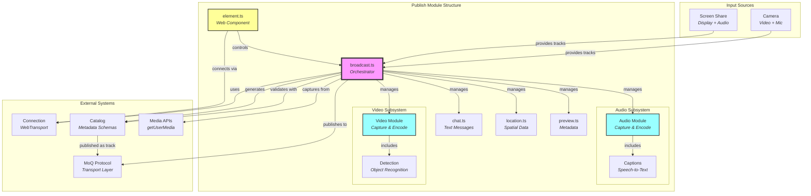
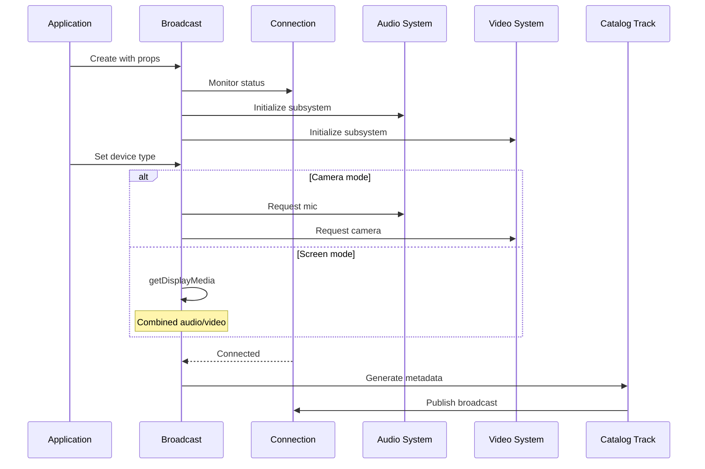
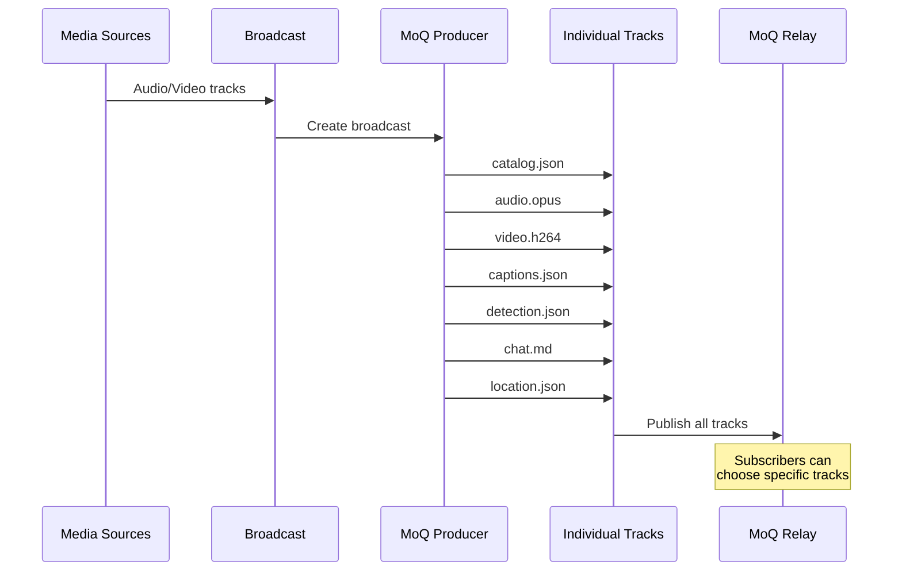
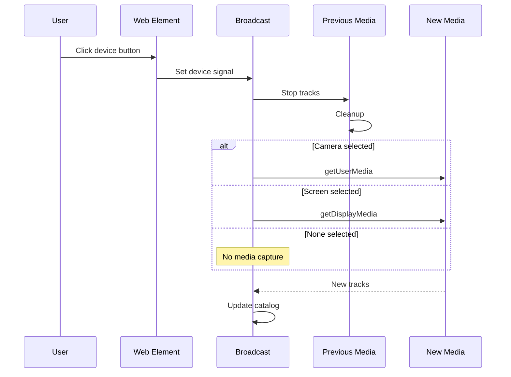

# Publish Module Documentation

## Overview

The publish module provides the **complete media broadcasting system** for real-time streaming. It orchestrates audio/video capture, encoding, AI-powered enhancements (captions, object detection), and metadata publishing through a unified broadcast interface. Think of it as the **production studio** that transforms local media inputs into a complete, accessible streaming broadcast with multiple synchronized tracks.

> 💡 **For Beginners: What's a "broadcast" in streaming?**
> 
> A broadcast is like a TV channel - it contains multiple synchronized tracks (video, audio, captions, chat) that viewers can subscribe to. Unlike traditional broadcasting, MoQ broadcasts are peer-to-peer capable and can scale through relay networks.

## Purpose

The publish module serves as the **broadcast orchestration layer**, enabling:
- **Unified broadcast management** for all media types
- **Device selection** between camera and screen sharing
- **Automatic media capture** with permission handling
- **Catalog publishing** for broadcast discovery
- **Multi-track synchronization** (audio, video, captions, chat, location)
- **Web component interface** for easy HTML integration
- **Preview capabilities** for lightweight metadata broadcasting

## Module Architecture

### Core Components

The publish module consists of:
- **Root orchestration files** - Broadcast management and coordination
- **Audio subsystem** - Audio capture, encoding, and AI captions
- **Video subsystem** - Video capture, encoding, and object detection
- **Supporting features** - Chat, location tracking, preview metadata

### File Descriptions

#### `broadcast.ts` - Broadcast Orchestrator
**Achieves**: Orchestrates all publishing components into a cohesive broadcast with automatic media management.

The Broadcast class provides:

##### **Core Responsibilities**
- **Component Management** - Creates and coordinates all publishing subsystems
- **Media Capture** - Handles getUserMedia/getDisplayMedia permissions
- **Device Switching** - Manages camera vs screen share modes
- **Track Publishing** - Registers all tracks with MoQ transport
- **Catalog Generation** - Publishes broadcast metadata

##### **Device Management**
Two distinct capture modes:
- **Camera Mode** - Separate audio/video permission requests
- **Screen Mode** - Combined audio/video from display capture

##### **Catalog Publishing**
Generates comprehensive metadata:
- Video configurations (codec, resolution, framerate)
- Audio configurations (codec, channels, sample rate)
- Caption availability
- Object detection availability
- Location tracking
- Chat support
- User information

##### **Lifecycle Management**
- **Effect-based activation** - Components activate based on signals
- **Automatic cleanup** - Stops media tracks when switching devices
- **Connection awareness** - Only publishes when connected
- **Name-based routing** - Broadcast path determines relay routing

#### `chat.ts` - Text Communication
**Achieves**: Provides real-time text messaging within broadcasts using markdown format.

Features:
- **Markdown format** - Rich text support
- **Single message groups** - Each message is a complete group
- **Catalog integration** - Publishes track metadata
- **Signal-based updates** - Reactive message publishing

#### `location.ts` - Spatial Positioning
**Achieves**: Manages spatial positioning for multi-user environments with peer-to-peer updates.

The Location class enables:

##### **Self Position Broadcasting**
- Publishes own position updates
- JSON-encoded position data
- Initial position in catalog
- Handle for peer requests

##### **Peer Position Requests**
The LocationPeer subsystem:
- Requests position from specific peers
- Creates dedicated tracks per peer
- Manages peer catalog entries
- Enables spatial audio/video

##### **Catalog Structure**
- `initial` - Starting position
- `updates` - Track for position changes
- `handle` - Identifier for peer requests
- `peers` - Map of peer handles to tracks

#### `preview.ts` - Metadata Broadcasting
**Achieves**: Publishes lightweight preview information without full media streams.

Features:
- **Minimal bandwidth** - JSON metadata only
- **Room information** - Title, description, thumbnail
- **User lists** - Active participants
- **Empty group support** - Placeholder when no info

#### `element.ts` - Web Component Interface
**Achieves**: Provides an HTML custom element for easy broadcast integration.

The `<hang-publish>` element offers:

##### **HTML Attributes**
- `url` - WebTransport endpoint
- `name` - Broadcast path
- `device` - "camera" or "screen"
- `audio` - Enable audio capture
- `video` - Enable video capture
- `controls` - Show UI controls
- `transcribe` - Enable speech-to-text
- `captions` - Display caption text

##### **Built-in UI**
- Device selection buttons (camera/screen/none)
- Connection status indicator
- Live caption display with speaking indicator
- Video preview element

##### **Reactive Updates**
- Attributes map to broadcast signals
- Real-time status updates
- Automatic media preview

#### `index.ts` - Module Exports
**Achieves**: Provides clean public API for the publish module.

Exports all components except the web element (requires separate import for tree-shaking).

## Architectural Relationships



> 💡 **For Beginners: Reading this diagram**
> 
> - **Pink (broadcast)** is the central orchestrator that manages everything
> - **Blue (audio/video)** are the main media processing subsystems
> - **Yellow (element)** is the web component that provides the HTML interface
> - **Arrows** show data flow and control relationships

## Data Flow Patterns

### Broadcast Initialization Flow


### Multi-Track Publishing Flow


### Device Switching Flow


## Key Design Principles

1. **Declarative Configuration** - Signal-based reactive state management
2. **Separation of Concerns** - Each subsystem handles one responsibility
3. **Effect-based Lifecycle** - Components activate/deactivate based on signals
4. **Privacy by Design** - AI processing happens on-device
5. **Progressive Enhancement** - Core functionality works, AI features optional
6. **Web Standards First** - Uses native APIs with polyfills as fallback

> 💡 **For Beginners: Understanding these principles**
> 
> - **Declarative** means you describe *what* you want, not *how* to do it
> - **Separation of concerns** means each file has one clear job
> - **Effect-based** means components automatically respond to changes
> - **Progressive enhancement** means basic features work everywhere, fancy features when available

## Configuration Patterns

### Minimal Broadcasting
```typescript
// Just video, no extras
const broadcast = new Broadcast(connection, {
  enabled: true,
  name: "my-stream",
  device: "camera",
  video: { enabled: true }
});
```

### Full-Featured Broadcasting
```typescript
// Everything enabled
const broadcast = new Broadcast(connection, {
  enabled: true,
  name: "conference/room-123",
  device: "camera",
  audio: {
    enabled: true,
    captions: { enabled: true }
  },
  video: {
    enabled: true,
    detection: { enabled: true }
  },
  chat: { enabled: true },
  location: {
    enabled: true,
    handle: "user-123"
  },
  preview: {
    enabled: true,
    info: {
      title: "Team Meeting",
      description: "Weekly sync"
    }
  }
});
```

### HTML Integration
```html
<hang-publish
  url="wss://relay.example.com"
  name="conference/main"
  device="camera"
  audio
  video
  controls
  transcribe
  captions>
  <video autoplay muted></video>
</hang-publish>
```

## Performance Considerations

- **Lazy Initialization** - Subsystems only activate when enabled
- **Track Prioritization** - Audio/video priority 1, metadata priority 0
- **Worker Isolation** - AI processing in separate threads
- **Effect Cleanup** - Automatic resource disposal
- **Frame Cloning** - Detection doesn't block encoding
- **Catalog Caching** - Only updates on actual changes

## Browser Compatibility

### Required APIs
- **WebTransport** - For MoQ protocol
- **WebCodecs** - For media encoding
- **MediaDevices** - For capture
- **Custom Elements** - For web component

### Progressive Features
- **AudioWorklet** - Enhanced audio processing
- **MediaStreamTrackProcessor** - Efficient video frames
- **WebGPU** - Accelerated AI inference
- **CaptureController** - Screen share controls

## Usage Patterns

### Programmatic Control
```typescript
// Create and configure
const connection = new Connection(url);
const broadcast = new Broadcast(connection);

// Dynamic updates
broadcast.device.set("screen");
broadcast.audio.volume.set(0.5);
broadcast.video.detection.enabled.set(true);

// Monitor state
broadcast.published.subscribe(published => {
  console.log("Broadcasting:", published);
});
```

### React Integration
```jsx
function StreamingApp() {
  useEffect(() => {
    const element = document.querySelector("hang-publish");
    element.url = "wss://relay.example.com";
    element.name = `user/${userId}`;
    element.device = "camera";
  }, [userId]);
  
  return (
    <hang-publish controls transcribe captions>
      <video autoplay muted />
    </hang-publish>
  );
}
```

### Multi-User Spatial
```typescript
// Broadcast with location
const broadcast = new Broadcast(connection, {
  location: {
    enabled: true,
    current: { x: 0, y: 0, z: 0 },
    handle: userId
  }
});

// Request peer positions
const peer = broadcast.location.peer("other-user");
peer.producer.subscribe(producer => {
  if (producer) {
    producer.update({ x: 10, y: 20, z: 0 });
  }
});
```

## Best Practices

1. **Check Permissions** - Handle getUserMedia rejections gracefully
2. **Monitor Connection** - Don't try publishing when disconnected
3. **Clean Shutdown** - Always call close() to stop media tracks
4. **Signal Hygiene** - Use peek() for one-time reads, subscribe() for updates
5. **Device Switching** - Stop previous tracks before requesting new ones
6. **Catalog Updates** - Let the system manage catalog generation
7. **Error Boundaries** - Wrap web components in error handlers

## Common Patterns

### Auto-reconnection
```typescript
connection.status.subscribe(status => {
  if (status === "disconnected") {
    // Broadcast automatically stops publishing
    // Will resume when reconnected
  }
});
```

### Device Permissions
```typescript
broadcast.device.set("camera");
// Wait for permission prompt
broadcast.audio.media.subscribe(track => {
  if (!track) {
    console.log("Microphone permission denied");
  }
});
```

### Dynamic Features
```typescript
// Start with basic streaming
broadcast.audio.enabled.set(true);
broadcast.video.enabled.set(true);

// Add features based on user preference
if (userWantsCaptions) {
  broadcast.audio.captions.enabled.set(true);
}

if (userWantsDetection) {
  broadcast.video.detection.enabled.set(true);
}
```

## Debugging Tips

1. **Check catalog track** - First track published, contains all metadata
2. **Monitor signals** - Use peek() to inspect current values
3. **Track priorities** - Audio/video at 1, metadata at 0
4. **Console logs** - Broadcast logs catalog updates
5. **Network tab** - WebTransport shows as "webtransport" protocol
6. **Media permissions** - Check browser settings if capture fails

## Future Enhancements

- **Simulcast** - Multiple quality levels
- **SVC** - Scalable video coding
- **E2E Encryption** - Media privacy
- **Recording** - Local/cloud storage
- **Filters** - Video effects and backgrounds
- **Screen Annotation** - Drawing tools for screen share