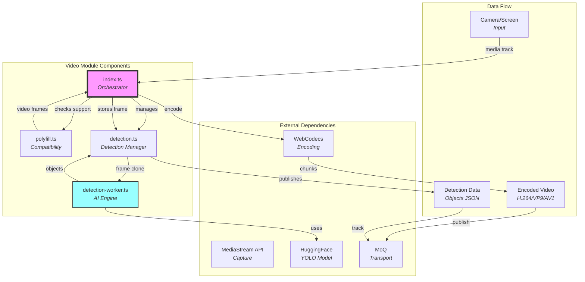
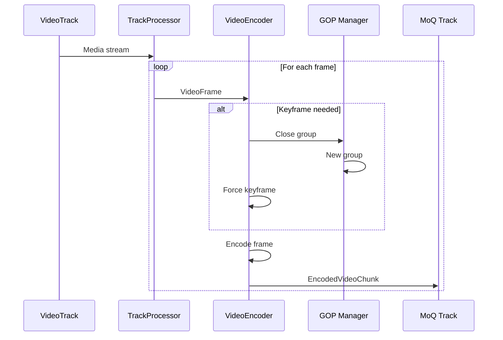
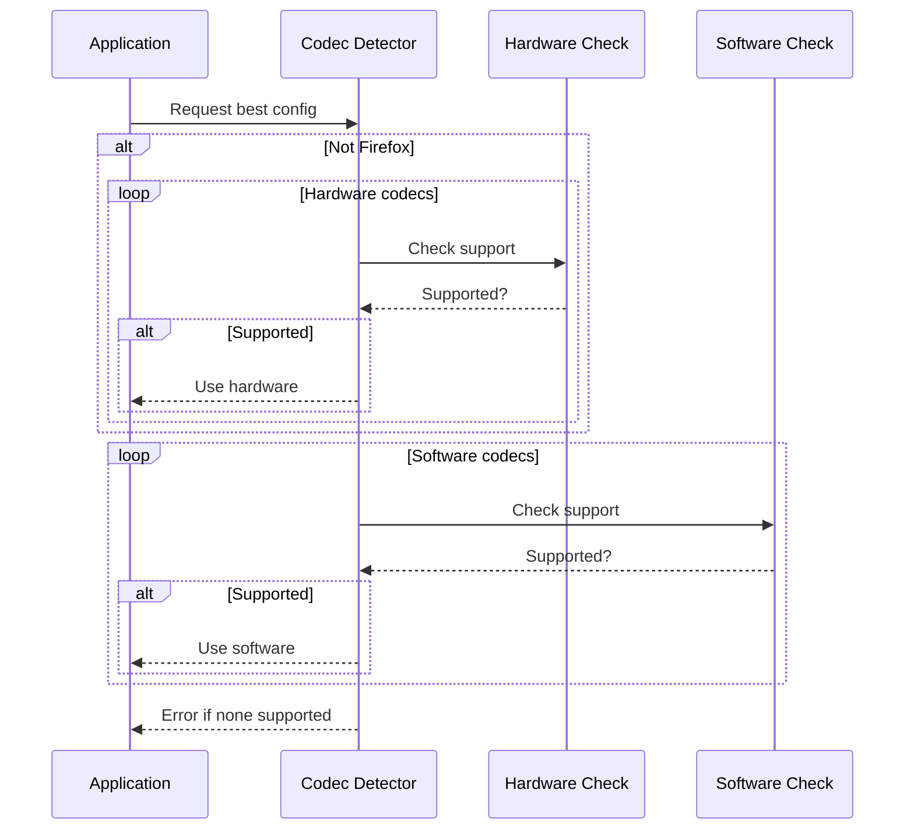
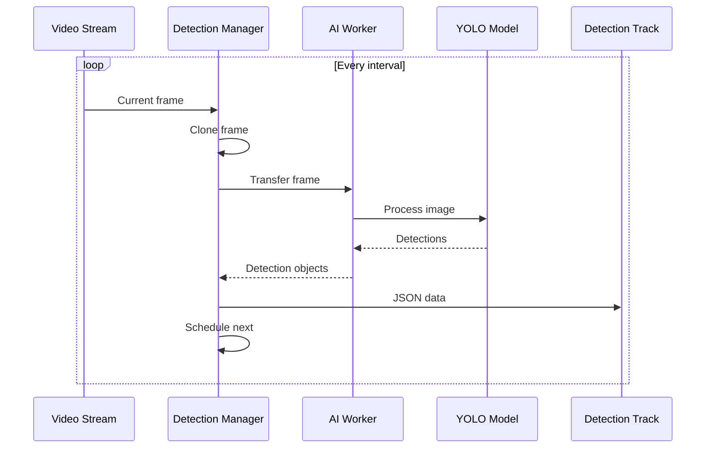

# Publish/Video Module Documentation

## Overview

The publish/video module provides **real-time video capture, encoding, and streaming** capabilities with optional AI-powered object detection. It captures video from camera or screen share, processes frames through WebCodecs, intelligently selects codecs based on hardware capabilities, and can perform real-time object detection. Think of it as the **video production pipeline** that transforms camera input into optimized streaming media with AI enhancements.

## Purpose

The video module serves as the **video publishing layer**, enabling:
- **Video capture** from camera or screen share
- **Intelligent codec selection** based on hardware capabilities
- **Adaptive bitrate encoding** for optimal quality
- **Real-time object detection** using on-device AI
- **Cross-browser compatibility** with polyfills
- **GOP management** for efficient streaming

## File Descriptions

### `index.ts` - Video Publishing Core
**Achieves**: Orchestrates the complete video publishing pipeline from capture to transmission with intelligent codec selection.

The Video class provides:

#### **Core Components**
- **Media Management** - Processes VideoTrack inputs
- **Signal-based State** - Reactive properties for configuration
- **Catalog Generation** - Creates metadata describing video stream
- **Frame Storage** - Maintains latest VideoFrame for detection

#### **Video Processing Pipeline**
1. **Track Creation** - Generates unique track names
2. **Frame Capture** - Uses MediaStreamTrackProcessor or polyfill
3. **Codec Selection** - Intelligent hardware/software detection
4. **Encoding** - Compresses using optimal codec
5. **GOP Management** - Groups frames with 2-second keyframe interval
6. **Catalog Updates** - Publishes stream configuration

#### **Codec Selection Strategy**
The module implements a sophisticated codec selection algorithm:

**Hardware Priority Order**:
1. VP9 - Good compression, common hardware decode
2. H.264 - Universal hardware support
3. AV1 - Future-proof, excellent compression
4. HEVC/H.265 - Good compression, licensing issues
5. VP8 - Fallback option

**Software Priority Order**:
1. H.264 - Fast software encoding
2. VP8 - Simple codec
3. VP9 - More expensive but efficient
4. HEVC - Licensing limitations
5. AV1 - Very expensive to encode

#### **Bitrate Calculation**
Dynamic bitrate based on resolution and framerate:
```
Base formula: pixels * 0.07 * framerateFactor
Framerate factor: 30 + (fps - 30) / 2

Examples:
- 480p@30: ~0.9 Mbps
- 720p@30: ~1.9 Mbps  
- 1080p@30: ~4.4 Mbps
- 1080p@60: ~6.5 Mbps
```

Codec-specific adjustments:
- VP9: 80% of H.264 bitrate
- AV1: 60% of H.264 bitrate
- VP8: 110% of H.264 bitrate

#### **Configuration Properties**
- `enabled` - Whether to publish video
- `media` - The VideoTrack to publish
- `constraints` - Media constraints for capture
- `detection` - Object detection settings

#### **Key Features**
- **Firefox Support** - Detects and avoids hardware on Firefox
- **Annex-B Format** - For H.264/HEVC resolution changes
- **Real-time Mode** - Optimizes for low latency
- **Dynamic GOP** - 2-second keyframe intervals

### `polyfill.ts` - Browser Compatibility Layer
**Achieves**: Provides fallback video capture for browsers without MediaStreamTrackProcessor support.

The polyfill implements:

#### **Feature Detection**
- Checks for native MediaStreamTrackProcessor
- Falls back to canvas-based capture
- Warns about performance impact

#### **Canvas-based Capture**
- Creates hidden video element
- Draws frames to canvas at specified framerate
- Converts canvas to VideoFrame
- Throttles to match target framerate

#### **Limitations**
- Higher CPU usage than native API
- Potential frame drops
- Less accurate timestamps
- No hardware acceleration

### `detection.ts` - Object Detection Manager
**Achieves**: Coordinates AI-powered object detection on video frames and publishes results.

The Detection class provides:

#### **Detection Pipeline**
1. **Frame Sampling** - Captures frames at intervals
2. **Worker Communication** - Sends frames to AI worker
3. **Result Processing** - Receives detection objects
4. **Track Publishing** - Streams detection data as JSON
5. **Signal Updates** - Publishes detected objects

#### **Configuration**
- `enabled` - Whether to run detection
- `interval` - Milliseconds between detections (default 1000ms)
- `threshold` - Confidence threshold (default 0.5)

#### **Features**
- **Non-blocking** - Runs in web worker
- **Frame Cloning** - Doesn't interfere with encoding
- **Adaptive Timing** - Waits for detection completion
- **Comlink Integration** - Efficient worker communication

### `detection-worker.ts` - AI Object Detection Engine
**Achieves**: Performs real-time object detection using the YOLO model in a web worker.

The DetectionWorker implements:

#### **Model Loading**
- Uses Xenova/gelan-c_all YOLO model
- Loads model and processor asynchronously
- Configures for 128px input size (performance)

#### **Detection Process**
1. **Frame Conversion** - Converts to RGBA format
2. **Buffer Management** - Reuses buffers for efficiency
3. **Image Processing** - Prepares for model input
4. **Model Inference** - Runs YOLO detection
5. **Result Formatting** - Normalizes coordinates to 0-1

#### **Output Format**
Returns array of detection objects:
- `label` - Object class name
- `score` - Confidence (0-1)
- `x, y` - Normalized position
- `w, h` - Normalized dimensions

#### **Performance Optimizations**
- Buffer reuse prevents allocations
- Small input size (128px) for speed
- Worker isolation prevents main thread blocking
- Sorted results by confidence

## Architectural Relationships



## Processing Pipeline

### Video Capture Flow


### Codec Selection Flow


### Object Detection Flow


## Key Design Principles

1. **Hardware Awareness** - Prioritizes hardware acceleration
2. **Browser Compatibility** - Polyfills for missing features
3. **AI on Device** - Privacy-preserving object detection
4. **Adaptive Quality** - Dynamic codec and bitrate selection
5. **Non-blocking Processing** - Workers for heavy computation

## Configuration Details

### Video Settings
- **GOP Duration** - 2 seconds between keyframes
- **Latency Mode** - "realtime" for WebRTC-like behavior
- **Track Priority** - 1 (same as audio)
- **Framerate** - Preserves source framerate

### Detection Settings
- **Default Interval** - 1000ms between detections
- **Default Threshold** - 0.5 confidence minimum
- **Model Input Size** - 128px for performance
- **Output Format** - Normalized coordinates (0-1)

### Codec Configurations
- **H.264** - Annex-B format for flexibility
- **HEVC** - Annex-B format (where supported)
- **VP9** - 20% bitrate reduction
- **AV1** - 40% bitrate reduction
- **VP8** - 10% bitrate increase

## Performance Considerations

- **Frame Cloning** - Detection doesn't block encoding
- **Worker Isolation** - AI runs in separate thread
- **Buffer Reuse** - Minimizes memory allocation
- **Codec Caching** - One-time selection per stream
- **Lazy GOP Creation** - Groups created on demand

## Browser Compatibility

### Required APIs
- **MediaStreamTrackProcessor** - Preferred frame capture
- **VideoEncoder** - WebCodecs encoding
- **OffscreenCanvas** - Polyfill fallback
- **Web Workers** - Detection processing

### Known Limitations
- Firefox lacks reliable hardware detection
- Firefox needs MediaStreamTrackProcessor polyfill
- Safari may have limited codec support
- AI models require significant memory (~50MB)

## Usage Patterns

### Basic Video Publishing
```typescript
const video = new Video(broadcast, {
  enabled: true,
  media: videoTrack,
  constraints: {
    width: 1280,
    height: 720,
    frameRate: 30
  }
});
```

### With Object Detection
```typescript
const video = new Video(broadcast, {
  enabled: true,
  media: videoTrack,
  detection: {
    enabled: true,
    interval: 500,  // 2x per second
    threshold: 0.3  // More sensitive
  }
});

// React to detected objects
video.detection.objects.subscribe(objects => {
  renderBoundingBoxes(objects);
});
```

### Monitoring Encoding
```typescript
// Check if actively encoding
video.active.subscribe(active => {
  updateStatusIndicator(active);
});

// Access current frame
const frame = video.frame.peek();
if (frame) {
  processFrame(frame.clone());
}
```

## Best Practices

1. **Test Codec Support** - Verify before assuming availability
2. **Handle Firefox** - Account for missing hardware detection
3. **Clone Frames** - Don't modify frames in use
4. **Monitor Active State** - Know when encoding is running
5. **Configure Detection** - Balance accuracy vs performance
6. **Clean Shutdown** - Properly close video and detection