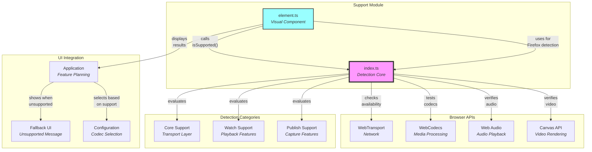
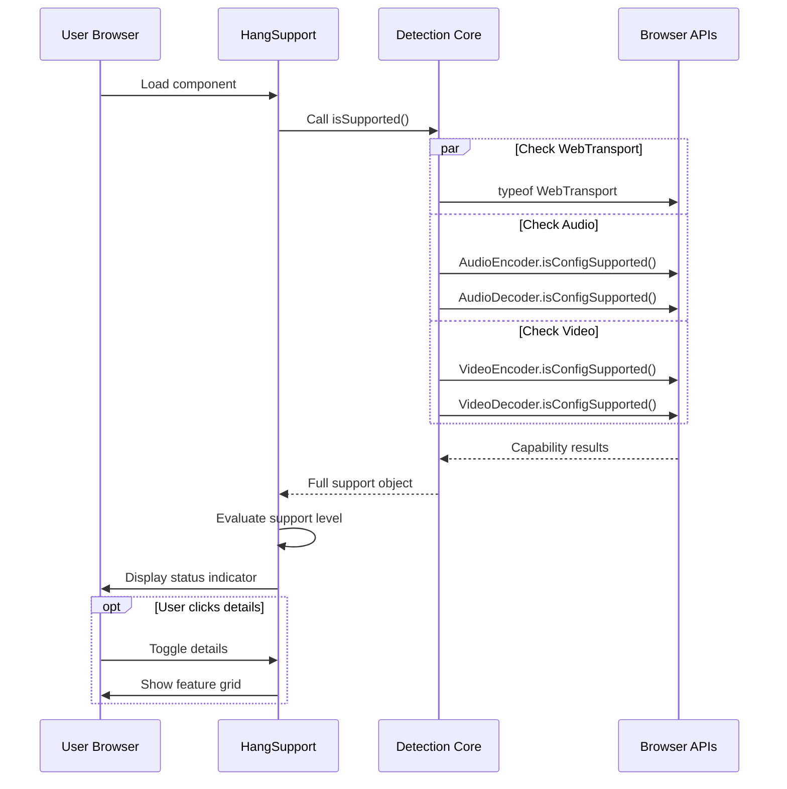

# Support Module Documentation

## Overview

The support module provides **browser capability detection** for the hang library. It determines what media features the user's browser can support and presents this information through both programmatic APIs and a visual Web Component. Think of it as a **compatibility checker** that tells users whether their browser can handle the required WebTransport, WebCodecs, and media processing features.

> 💡 **For Beginners: What's "capability detection"?**
> 
> Capability detection checks if a browser supports specific features before trying to use them. It's like checking if your phone has a camera before trying to take a photo. This prevents crashes and lets you provide alternatives when features are missing.

## Purpose

The support module serves as the **capability detection layer**, enabling:
- **Browser compatibility** checking before attempting media operations
- **Feature availability** detection for codecs and APIs
- **Hardware acceleration** detection for performance optimization
- **User feedback** through visual status indicators
- **Graceful degradation** planning based on available features

## File Descriptions

### `index.ts` - Capability Detection Core
**Achieves**: Detects browser support for all media streaming features and codec capabilities.

This file provides comprehensive capability detection:

#### **Type Definitions**
- **`SupportMode`** - Specifies what to check: `"core" | "watch" | "publish" | "all"`
- **`Partial`** - Support level: `"full" | "partial" | "none"`
- **`Audio`** - Audio codec support: `{ aac: boolean; opus: boolean }`
- **`Codec`** - Acceleration availability: `{ hardware?: boolean; software: boolean }`
  - `hardware` is `undefined` when detection isn't possible (e.g., Firefox)
- **`Video`** - Video codec support with `Codec` type for each: `h264`, `h265`, `vp8`, `vp9`, `av1`
- **`Full`** - Complete support structure containing all detection results

#### **Codec Configuration**
The `CODECS` constant defines test codec strings for each format:
- **AAC**: `"mp4a.40.2"` (AAC-LC)
- **Opus**: `"opus"`
- **AV1**: `"av01.0.08M.08"` (Main profile, level 4.0)
- **H.264**: `"avc1.640028"` (High profile, level 4.0)
- **H.265**: `"hev1.1.6.L93.B0"` (Main profile)
- **VP9**: `"vp09.00.10.08"` (Profile 0)
- **VP8**: `"vp8"`

> 💡 **For Beginners: What are codec strings?**
> 
> Codec strings are standardized identifiers that tell the browser exactly which video/audio format to use. They include details like:
> - The codec name (e.g., "avc1" = H.264)
> - Profile and level (determines quality/complexity limits)
> - Think of them like product model numbers - "avc1.640028" is like saying "H.264 Model High-4.0"

#### **Detection Functions**

**Audio Support Detection**:
- `audioDecoderSupported(codec)` - Tests `AudioDecoder.isConfigSupported()` with:
  - Codec string from `CODECS` constant
  - 2 channels, 48000Hz sample rate
  - Returns `boolean` for support
- `audioEncoderSupported(codec)` - Tests `AudioEncoder.isConfigSupported()` with same config

**Video Support Detection**:
- `videoDecoderSupported(codec)` - Returns `Codec` object with:
  - Tests both `"prefer-software"` and `"prefer-hardware"` acceleration
  - Returns `{ hardware?: boolean, software: boolean }`
  - Sets `hardware` to `undefined` on Firefox due to [detection issue](https://github.com/w3c/webcodecs/issues/896)
- `videoEncoderSupported(codec)` - Similar to decoder but includes:
  - Test resolution: 1280x720
  - Same Firefox workaround for hardware detection

#### **Main Detection Function**
`isSupported()` returns a `Promise<Full>` with comprehensive capability report:
- **`webtransport`**: `typeof WebTransport !== "undefined"`
- **`audio`** object:
  - `capture`: Checks `AudioWorkletNode` availability
  - `encoding`: Tests each codec via `audioEncoderSupported()` if `AudioEncoder` exists
  - `decoding`: Tests each codec via `audioDecoderSupported()` if `AudioDecoder` exists
  - `render`: Checks both `AudioContext` and `AudioBufferSourceNode` availability
- **`video`** object:
  - `capture`: Returns `Partial` type:
    - `"full"` if `MediaStreamTrackProcessor` available (preferred)
    - `"partial"` if only `OffscreenCanvas` available (fallback)
    - `"none"` if neither available
  - `encoding`: Tests all codecs via `videoEncoderSupported()` if `VideoEncoder` exists
  - `decoding`: Tests all codecs via `videoDecoderSupported()` if `VideoDecoder` exists
  - `render`: Checks both `OffscreenCanvas` and `CanvasRenderingContext2D` availability

> 💡 **For Beginners: What are these browser APIs?**
> 
> - **WebTransport**: Network protocol for real-time streaming (faster than WebSockets)
> - **AudioWorkletNode**: Low-latency audio processing in a separate thread
> - **WebCodecs** (AudioEncoder/Decoder, VideoEncoder/Decoder): Direct access to hardware codecs
> - **MediaStreamTrackProcessor**: Extracts raw frames from camera/screen capture
> - **OffscreenCanvas**: Canvas that works in background threads for better performance

### `element.ts` - Visual Support Indicator
**Achieves**: Provides a Web Component that visually displays browser support status with detailed breakdown.

The `HangSupport` Web Component (`class HangSupport extends HTMLElement`) provides:

#### **Configuration Attributes**
Observable via `static observedAttributes = ["mode", "show", "details"]`:
- **`mode`** - What features to check (`SupportMode`):
  - `"core"` - Only WebTransport
  - `"watch"` - Decoding/rendering features
  - `"publish"` - Encoding/capture features
  - `"all"` - Everything (default)
- **`show`** - When to display the component (`Partial`):
  - `"full"` - Always show (default)
  - `"partial"` - Only show if partial support
  - `"none"` - Only show if no support
- **`details`** - Whether to show detailed breakdown (boolean, presence = true)

#### **Internal State Management**
Uses signals from `@kixelated/signals` for reactive updates:
- `#mode`: Signal<SupportMode> - Current detection mode
- `#show`: Signal<Partial> - Display threshold
- `#details`: Signal<boolean> - Details visibility
- `#support`: Signal<Full | undefined> - Detection results
- `#close`: Signal<boolean> - Component visibility
- `#signals`: Effect - Manages reactive rendering

#### **Visual Elements**
- **Status Header** - Shows overall support level with emoji indicators:
  - 🟢 Full Browser Support
  - 🟡 Partial Browser Support
  - 🔴 No Browser Support
- **Details Button** - Toggles detailed feature breakdown
- **Close Button** - Hides the support indicator
- **Details Grid** - Shows individual feature support when expanded

#### **Support Evaluation Methods**

1. **`#getCoreSupport(support)`** - Returns `"full"` if WebTransport available, else `"none"`

2. **`#getWatchSupport(support)`** - Evaluates playback capability:
   - Returns `"none"` if missing decoders or renderers
   - Returns `"none"` if no codecs supported
   - Returns `"partial"` if some codecs missing
   - Returns `"full"` if all codecs supported

3. **`#getPublishSupport(support)`** - Evaluates capture/encoding:
   - Returns `"none"` if missing encoders or audio capture
   - Returns `"none"` if no codecs supported
   - Returns `"partial"` if video capture is `"partial"` or no hardware encoding
   - Returns `"full"` if everything available with hardware acceleration

4. **`#getSummary(support, mode)`** - Combines evaluations based on mode:
   - For `"core"`: Just core support
   - For `"watch"`: Just watch support
   - For `"publish"`: Just publish support
   - For `"all"`: Worst of watch and publish

#### **Reactive Rendering**
- **`#render(effect)`** - Main render method:
  - Checks if support data loaded and not closed
  - Evaluates display threshold based on `show` attribute
  - Creates container with max-width 28rem
  - Renders header and optional details grid
  - Uses `effect.cleanup()` for proper DOM cleanup
- **`#renderHeader()`** - Creates status display with buttons
- **`#renderSupportDetails()`** - Creates 3-column grid showing:
  - Feature categories and codec support
  - Special Firefox note about hardware detection when `isFirefox` is true

> 💡 **For Beginners: What are "signals" and "effects"?**
> 
> Signals are reactive variables - when they change, anything using them automatically updates. Effects are functions that re-run when their signal dependencies change. It's like Excel formulas - change a cell, and all formulas using it recalculate automatically.

## Architectural Relationships



## Support Detection Flow



## Key Design Principles

1. **Comprehensive Detection**: Tests all required APIs and codecs
2. **Hardware Awareness**: Distinguishes hardware vs software acceleration
3. **Browser Workarounds**: Handles Firefox hardware detection limitations
4. **Progressive Enhancement**: Identifies partial support scenarios
5. **User-Friendly Display**: Clear visual indicators with optional details

> 💡 **For Beginners: Hardware vs Software Acceleration**
> 
> - **Hardware acceleration** uses dedicated chips (GPU) for video processing - very fast and efficient
> - **Software acceleration** uses the main CPU - works but slower and uses more battery
> - It's like using a food processor (hardware) vs chopping by hand (software) - both work, but one is much faster

## Usage Patterns

### Programmatic Detection
```typescript
import { isSupported } from "@kixelated/hang/support";

const support = await isSupported();

if (!support.webtransport) {
  showError("WebTransport not supported");
  return;
}

if (support.video.encoding?.h264.hardware) {
  // Use H.264 with hardware acceleration
} else if (support.video.encoding?.vp9.software) {
  // Fall back to VP9 software encoding
}
```

### Web Component Usage
```html
<!-- Always visible -->
<hang-support mode="all" show="full"></hang-support>

<!-- Only show if partial support -->
<hang-support mode="watch" show="partial"></hang-support>

<!-- Show with details expanded -->
<hang-support details></hang-support>
```

The component is registered globally via `customElements.define("hang-support", HangSupport)` and properly typed for TypeScript users through the `HTMLElementTagNameMap` interface.

### Conditional Feature Enable
```typescript
const support = await isSupported();

// Disable features based on support
if (!support.video.capture || support.video.capture === "none") {
  disableVideoButton();
}

if (!support.audio.encoding?.opus) {
  // Use different audio codec or disable
}
```

## Support Levels Explained

### Full Support
- All requested features work with hardware acceleration where beneficial
- Best performance and quality
- All codecs supported

### Partial Support
- Core features work but with limitations:
  - Software-only codec support (slower)
  - Missing some codecs
  - Fallback capture methods (reduced quality)
- Application remains functional with degraded performance

### No Support
- Critical features missing:
  - No WebTransport (can't connect)
  - No WebCodecs (can't process media)
  - No capture/playback capabilities
- Application cannot function

## Browser Compatibility Notes

### Chrome/Chromium
- Generally full support for all features
- Hardware acceleration usually available
- MediaStreamTrackProcessor supported (TypeScript types not yet available, hence `@ts-expect-error`)

### Firefox
- WebTransport support varies by version
- Hardware acceleration detection unreliable (always shows as software) - [tracking issue](https://github.com/w3c/webcodecs/issues/896)
- Some capture APIs may use fallback methods
- Detection uses `isFirefox` from `util/hacks` module for workarounds

### Safari
- Limited WebTransport support
- WebCodecs support improving but incomplete
- Often shows partial or no support

> 💡 **For Beginners: Why browser differences matter**
> 
> Different browsers implement web standards at different speeds. Chrome usually leads with new features, Firefox follows closely but with some quirks, and Safari is often last. This is why we need capability detection - to know what will work in each user's browser.

## Performance Considerations

- **Async detection**: All codec checks are asynchronous
- **Caching results**: Detection runs once, results should be cached
- **Parallel checks**: Multiple codecs tested simultaneously
- **Minimal overhead**: Simple API availability checks

## Best Practices

1. **Check early**: Run detection before showing media UI
2. **Cache results**: Don't repeatedly call `isSupported()`
3. **Provide fallbacks**: Have a plan for partial support
4. **Show status**: Use the Web Component to inform users
5. **Test codecs**: Verify specific codecs you plan to use

## Error Handling

- **No exceptions**: Detection functions return boolean/undefined, never throw
- **Graceful fallback**: Missing APIs return `undefined`, not errors
- **Firefox workaround**: Hardware detection returns `undefined` on Firefox due to browser limitation
- **Safe defaults**: Unknown features assumed unsupported
- **Attribute validation**: Invalid attribute values throw descriptive errors in `attributeChangedCallback()`
- **Type narrowing**: Uses TypeScript exhaustive checks for compile-time safety

## Future Improvements

- Additional codec profiles/levels testing
- Performance benchmarking for software codecs
- Browser version-specific workarounds
- Bandwidth estimation for codec selection
- Storage of user's preferred codecs