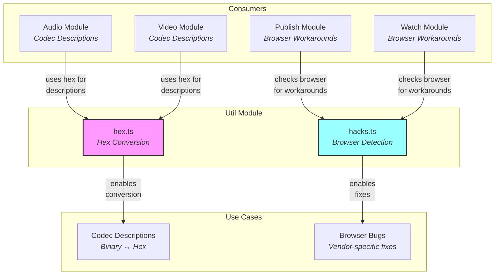
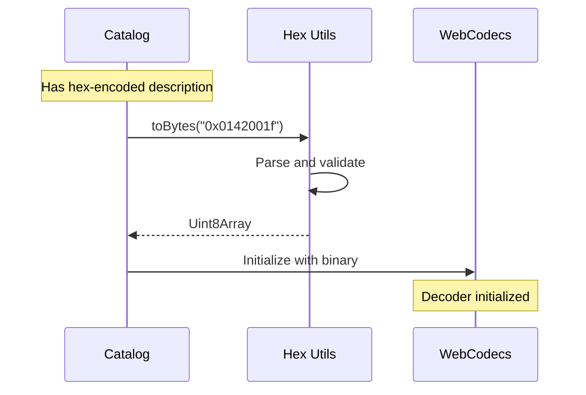
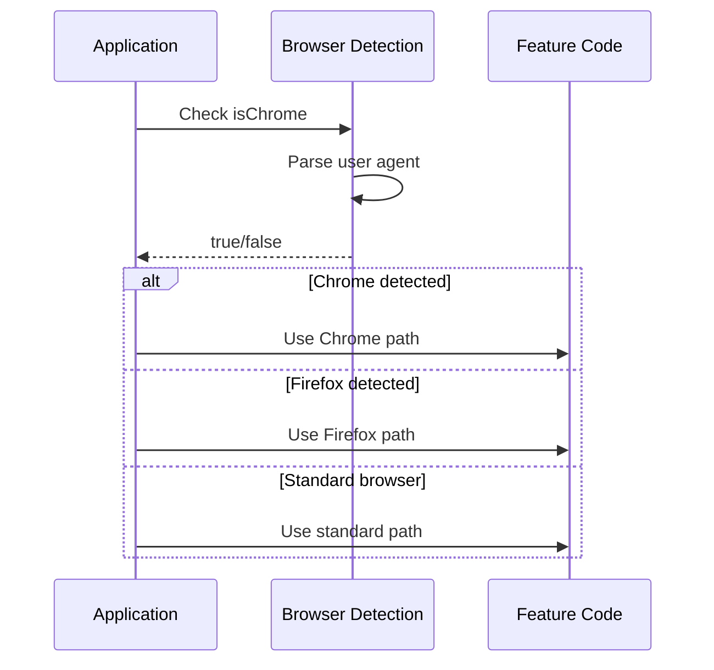

# Util Module Documentation

## Overview

The util module provides **low-level utility functions** for the hang library. It contains helper functions for browser detection and hexadecimal data conversion. Think of it as the **toolbox** containing small but essential utilities that other modules rely on for specific tasks.

> 💡 **For Beginners: What are "utility functions"?**
> 
> Utility functions are small, reusable pieces of code that perform common tasks. They're like kitchen tools - a can opener does one job well and is used by many recipes. Similarly, these utilities handle specific tasks (like converting data formats) that many parts of the application need.

## Purpose

The util module serves as the **shared utility layer**, enabling:
- **Browser detection** for working around vendor-specific bugs
- **Hex encoding/decoding** for codec descriptions and binary data
- **Cross-cutting concerns** that don't belong to specific modules
- **Workaround management** for browser incompatibilities
- **Data format conversion** between different representations

## File Descriptions

### `hacks.ts` - Browser Detection Workarounds
**Achieves**: Identifies the user's browser to enable vendor-specific workarounds for known bugs.

This file provides two exported constants:

#### **Browser Detection Constants**
- **`isChrome`**: `navigator.userAgent.toLowerCase().includes("chrome")`
  - Referenced bug: https://issues.chromium.org/issues/40504498
  - Detects Chrome/Chromium browsers (includes Edge, Brave, etc.)
  - Used for Chrome-specific WebCodecs or WebTransport workarounds
  
- **`isFirefox`**: `navigator.userAgent.toLowerCase().includes("firefox")`
  - Referenced bug: https://bugzilla.mozilla.org/show_bug.cgi?id=1967793
  - Detects Firefox browsers
  - Primarily used in support module for hardware acceleration detection issues

The detection uses simple user agent string matching with `.toLowerCase().includes()`, evaluated once at module load time. These boolean constants enable the library to adapt its behavior to work around known browser limitations.

> 💡 **For Beginners: What's a "user agent string"?**
> 
> The user agent string is text that browsers send to identify themselves. It looks like: `"Mozilla/5.0 (Windows NT 10.0; Win64; x64) Chrome/91.0.4472.124"`. While not 100% reliable (users can fake it), it's good enough for applying bug workarounds since users experiencing the bugs will have the real browser.

### `hex.ts` - Hexadecimal Conversion Utilities
**Achieves**: Converts between hexadecimal strings and byte arrays for codec descriptions and binary data handling.

This file provides two complementary functions:

#### **`toBytes(hex: string): Uint8Array`**
Converts hexadecimal strings to byte arrays:
- **Input handling**: Strips "0x" prefix if present using `hex.startsWith("0x") ? hex.slice(2) : hex`
- **Validation**: 
  - Checks even length with `hex.length % 2` (throws `"invalid hex string length"`)
  - Uses regex `.match(/.{2}/g)` to parse hex pairs
  - Throws `"invalid hex string format"` if regex fails
- **Conversion**: Maps each 2-char match to byte via `parseInt(byte, 16)`
- **Use case**: Converting hex-encoded codec descriptions to binary for WebCodecs

#### **`fromBytes(bytes: Uint8Array): string`**
Converts byte arrays to hexadecimal strings:
- **Implementation**: `Array.from(bytes, (byte) => byte.toString(16).padStart(2, "0")).join("")`
- **Output format**: Plain hex string without "0x" prefix
- **Padding**: Uses `padStart(2, "0")` to ensure each byte uses 2 hex characters
- **Use case**: Encoding binary data for JSON serialization in catalog

> 💡 **For Beginners: What's hexadecimal and why use it?**
> 
> Hexadecimal (hex) uses 16 symbols (0-9, A-F) to represent numbers. Each hex digit represents 4 bits, so two hex digits = 1 byte. We use hex because:
> - Binary data can't be directly stored in JSON (text format)
> - Hex is more compact than base10 (255 = "FF" vs "255")
> - It's a standard way to represent binary data as text
> - Example: The byte value 255 becomes "FF", byte value 0 becomes "00"

## Architectural Integration



## Usage Examples

### Browser Detection
```typescript
import { isChrome, isFirefox } from "../util/hacks";

// Constants are already evaluated - just use them directly
if (isChrome) {
  // Chrome includes Chromium-based browsers (Edge, Brave, Opera)
  config.hardwareAcceleration = "prefer-hardware";
}

if (isFirefox) {
  // Firefox-specific handling (e.g., hardware detection workaround)
  // Hardware acceleration detection always returns undefined
  config.hardwareAcceleration = "prefer-software";
}

// These are constants, not functions - no parentheses needed
console.log(`Chrome: ${isChrome}, Firefox: ${isFirefox}`);
```

### Hex Conversion
```typescript
import { toBytes, fromBytes } from "../util/hex";

// Convert hex codec description to binary (with or without 0x prefix)
const hexDescription = "0x0142001f";
const binaryDescription = toBytes(hexDescription);
// Result: Uint8Array([1, 66, 0, 31])

// Also works without prefix
const plainHex = "0142001f";
const sameBinary = toBytes(plainHex);
// Result: Uint8Array([1, 66, 0, 31])

// Convert binary data to hex for JSON (no prefix added)
const binaryData = new Uint8Array([255, 0, 128]);
const hexString = fromBytes(binaryData);
// Result: "ff0080" (note: lowercase, padded)

// Error handling
try {
  toBytes("01420");  // Odd length
} catch (e) {
  // Error: "invalid hex string length"
}
```

## Data Flow

### Codec Description Flow


### Browser Detection Flow


## Key Design Principles

1. **Minimal Surface Area**: Only essential utilities, no feature creep
2. **Pure Functions**: No side effects, predictable behavior
3. **Error Transparency**: Clear error messages for invalid inputs
4. **Browser Agnostic**: Core functionality works everywhere, detection enables optional workarounds
5. **Type Safety**: Proper TypeScript types for all functions

> 💡 **For Beginners: What are "pure functions"?**
> 
> Pure functions always return the same output for the same input and don't change anything outside themselves. Like a math formula: 2 + 2 always equals 4. They're predictable, testable, and don't cause surprise bugs from hidden side effects.

## Implementation Details

### Browser Detection
- Uses `navigator.userAgent.toLowerCase()` for case-insensitive detection
- Simple string matching with `.includes("chrome")` and `.includes("firefox")`
- Exports boolean constants (`const`), not functions
- Evaluated once at module load time (not re-evaluated on each access)
- Note: Chrome detection will also match Edge, Brave, Opera (all Chromium-based)

### Hex Conversion
- **Prefix handling**: `hex.startsWith("0x") ? hex.slice(2) : hex`
- **Length validation**: `hex.length % 2` check for even length
- **Parsing**: Regex `/.{2}/g` splits into 2-character chunks
- **Conversion**: `parseInt(byte, 16)` for hex→decimal, `toString(16)` for decimal→hex
- **Padding**: `padStart(2, "0")` ensures "f" becomes "0f"
- **Array operations**: `Array.from()` with mapping function for efficiency

## Common Use Cases

### Codec Initialization
The primary use of hex utilities is converting codec descriptions:
```typescript
// In catalog
const audioConfig = {
  codec: "opus",
  description: "0x..." // Hex-encoded Opus header
};

// When initializing decoder
const decoder = new AudioDecoder({
  codec: audioConfig.codec,
  description: toBytes(audioConfig.description)
});
```

### Browser-Specific Features
Browser detection enables conditional feature usage:
```typescript
// Chrome supports certain experimental features
if (isChrome) {
  // Enable Chrome-only feature
  controller.setFocusBehavior("no-focus-change");
}

// Firefox may need different configuration
if (isFirefox) {
  // Adjust for Firefox
  config.preferCurrentTab = false;
}
```

## Error Handling

### Hex Conversion Errors
- **Odd length**: Throws `Error("invalid hex string length")` when `hex.length % 2` is truthy
- **Invalid format**: Throws `Error("invalid hex string format")` when regex match returns null
- Both are standard `Error` objects with descriptive messages
- No error recovery - caller must handle with try/catch

### Browser Detection
- No errors possible - always returns boolean value
- If `navigator.userAgent` is undefined (rare), `includes()` would throw but this is unlikely in browser environment
- Future-proof: Unknown browsers return `false` for both constants
- No Safari/Edge specific detection - they return `false` for `isFirefox` and Edge returns `true` for `isChrome`

## Performance Considerations

- **Browser detection**: Computed once at module load, stored as constants
- **Hex conversion**: 
  - O(n) time complexity where n = string/array length
  - `toBytes`: One regex match, one map operation
  - `fromBytes`: Single Array.from with inline mapping
- **No dependencies**: Pure JavaScript, no external libraries
- **Tree-shakeable**: Unused utilities can be eliminated by bundlers
- **Memory efficient**: No intermediate storage beyond necessary arrays

> 💡 **For Beginners: What's "tree-shaking"?**
> 
> Tree-shaking is when build tools automatically remove unused code from your final bundle. If you only import `isChrome` but never use `isFirefox`, the Firefox code won't be included in your app. It's like shaking a tree and only keeping the fruit that doesn't fall off.

## Future Improvements

### Potential Enhancements
- **Base64 support**: Alternative to hex for codec descriptions
- **More browser detection**: Safari, Edge-specific flags
- **Binary utilities**: Additional binary data helpers
- **Validation utilities**: Common validation functions

### Known TODOs from Source Code
- Catalog module has developer TODO to switch from hex to base64 for codec descriptions
- Browser bug tracking links may need updates as issues are resolved
- Additional browser detection may be needed as new bugs are discovered
- No explicit TODOs in the util module source files themselves

## Best Practices

1. **Check browser once**: Store result rather than repeated checks
2. **Handle all browsers**: Always provide fallback for undetected browsers
3. **Validate hex input**: Don't assume hex strings are valid
4. **Document workarounds**: Link to bug reports when using browser detection
5. **Keep utilities focused**: Resist adding unrelated functionality

## Integration Notes

- **No external dependencies**: Pure utility functions with no imports (except navigator global)
- **Synchronous operations**: No async/promises needed, all operations are synchronous
- **Module exports**: Direct named exports (`export const`), no default export
- **TypeScript types**: Inferred types, no explicit type exports needed
- **Side-effect free**: Safe for tree-shaking and optimization (except browser detection evaluation at load)
- **File size**: Both files are very small (<20 lines each), minimal bundle impact