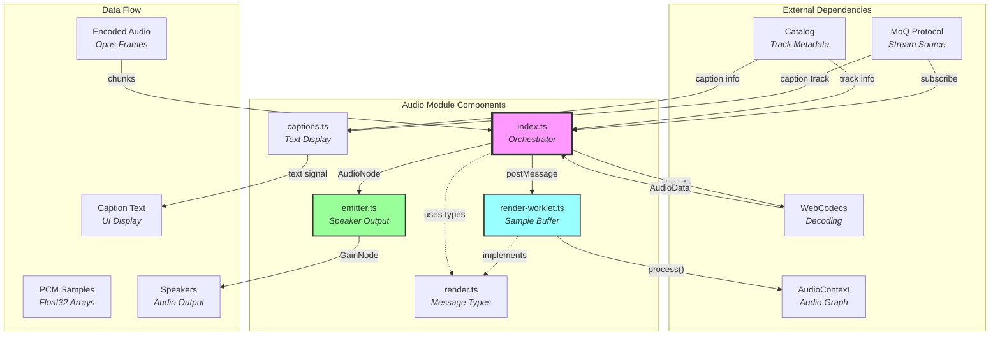
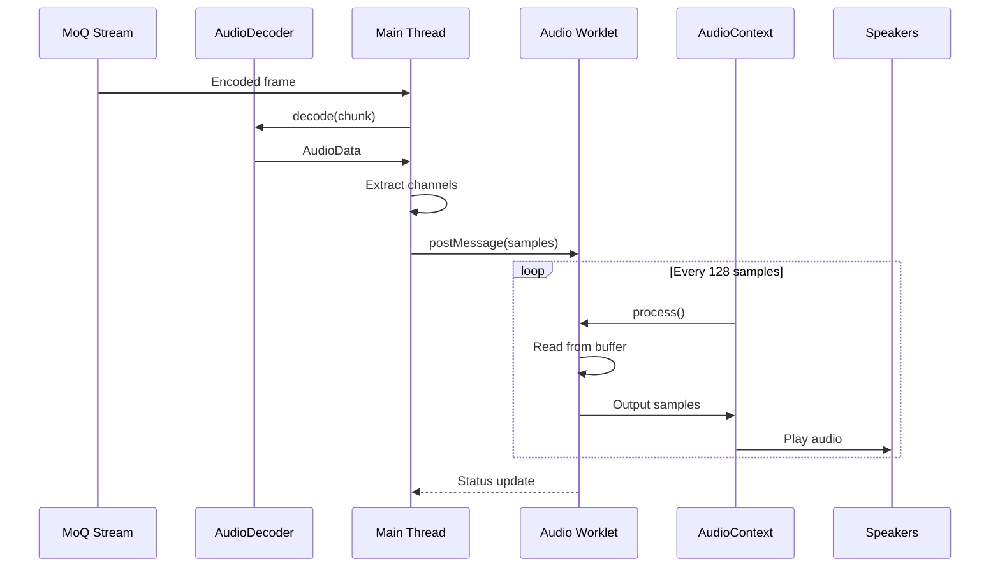
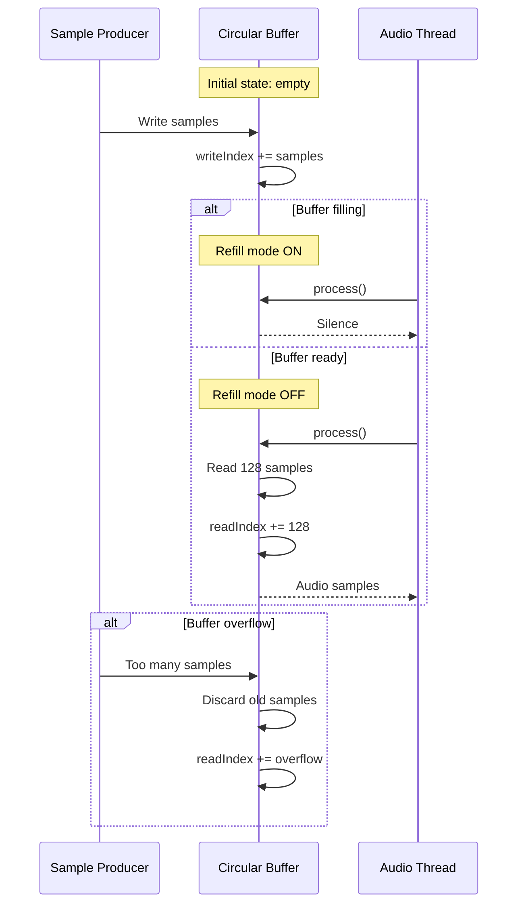

# Watch/Audio Module Documentation

## Overview

The watch/audio module provides **real-time audio playback and decoding** capabilities for consuming audio streams. It receives encoded audio tracks via MoQ, decodes them using WebCodecs, buffers samples for smooth playback, and optionally displays captions. Think of it as the **audio playback pipeline** that transforms streaming media into audible sound with synchronized text captions.

> 💡 **For Beginners: What's audio "watching" in streaming?**
> 
> "Watching" audio means receiving and playing back audio streams in real-time. Despite the name "watch", this module handles audio playback, buffering to prevent stuttering, volume control, and caption synchronization.

## Purpose

The audio module serves as the **audio consumption layer**, enabling:
- **Audio decoding** from Opus or other codecs
- **Sample buffering** for smooth playback
- **Low-latency rendering** via AudioWorklet
- **Volume control** with smooth transitions
- **Caption synchronization** for accessibility
- **Audio graph access** for visualizations

## File Descriptions

### `index.ts` - Audio Playback Core
**Achieves**: Orchestrates the complete audio playback pipeline from subscription to speaker output.

The Audio class provides:

#### **Core Components**
- **Track Subscription** - Consumes audio tracks from broadcast
- **Decoder Setup** - Configures WebCodecs for the stream codec
- **Worklet Management** - Creates AudioWorkletNode for playback
- **Caption Integration** - Manages synchronized text display
- **Audio Graph Root** - Exposes AudioNode for custom processing

#### **Audio Processing Pipeline**
1. **Track Discovery** - Finds audio track in catalog
2. **Subscription** - Opens stream for the audio track
3. **Frame Reception** - Receives encoded audio chunks
4. **Decoding** - Converts compressed audio to PCM samples
5. **Worklet Transfer** - Sends samples to audio thread
6. **Buffering** - Maintains latency buffer for smooth playback
7. **Rendering** - Outputs samples to AudioContext

#### **Configuration Properties**
- `enabled` - Whether to download and play audio
- `latency` - Buffer size hint (default 100ms)
- `captions` - Caption display configuration

#### **Key Features**
- **Adaptive Sample Rate** - Matches source stream rate
- **Multi-channel Support** - Handles stereo and beyond
- **Buffer Monitoring** - Tracks buffered duration
- **Planar Format** - Efficient channel-separated processing
- **Context Reuse** - One AudioContext per stream

### `captions.ts` - Caption Display Manager
**Achieves**: Receives and displays synchronized text captions from the caption track.

The Captions class provides:

#### **Caption Pipeline**
1. **Track Discovery** - Finds caption track in audio metadata
2. **Subscription** - Opens stream for captions
3. **Frame Decoding** - Converts bytes to text
4. **Signal Updates** - Publishes text for UI display

#### **Configuration**
- `enabled` - Whether to download and display captions

#### **Output Signals**
- `text` - Current caption text (undefined when no caption)

### `emitter.ts` - Audio Output Controller
**Achieves**: Manages audio playback to speakers with volume control and muting.

The AudioEmitter class provides:

#### **Volume Management**
- **Smooth Transitions** - Exponential gain ramps (200ms)
- **Mute Logic** - Volume 0 equals muted state
- **Unmute Memory** - Restores previous volume
- **Min Gain Handling** - Avoids audio clicks (0.001 threshold)

#### **Playback Control**
- `volume` - 0 to 1 gain level
- `muted` - Boolean mute state
- `paused` - Stops downloading (vs muted which still downloads)

#### **Audio Graph Integration**
- Creates GainNode for volume control
- Connects to AudioContext destination
- Maintains connection to source Audio instance

### `render.ts` - Message Type Definitions
**Achieves**: Defines the communication protocol between main thread and audio worklet.

Message types:
- **Init** - Configuration with sample rate, channels, latency
- **Data** - Audio samples with timestamp
- **Status** - Buffer utilization feedback

### `render-worklet.ts` - Audio Sample Renderer
**Achieves**: Runs in the audio thread to maintain sample buffer and output audio with minimal latency.

The Render AudioWorkletProcessor:

#### **Circular Buffer Management**
- **Per-channel Buffers** - Separate Float32Array for each channel
- **Ring Buffer Pattern** - Write and read pointers wrap around
- **Overflow Prevention** - Discards old samples when full
- **Underrun Detection** - Returns silence when empty

#### **Buffer Sizing**
- Calculated from sample rate and latency target
- Example: 48kHz × 100ms = 4,800 samples buffer

#### **Processing Logic**
1. **Initialization** - Creates buffers based on Init message
2. **Data Reception** - Writes samples at write position
3. **Audio Callback** - Reads 128 samples per process() call
4. **Pointer Management** - Advances read position, wraps at boundary
5. **Status Reporting** - Sends buffer utilization to main thread

#### **Refill Mechanism**
- Waits for initial buffer fill before outputting
- Prevents stuttering at stream start
- Resets on buffer underrun

## Architectural Relationships



> 💡 **For Beginners: Understanding the audio flow**
> 
> 1. Compressed audio arrives from the network (MoQ)
> 2. WebCodecs decoder converts it to raw samples
> 3. Samples go to a worklet (special audio thread) for buffering
> 4. Worklet outputs steady stream to speakers
> 5. Volume control happens via the emitter's GainNode

## Processing Pipeline

### Audio Playback Flow


### Buffer Management Flow


## Key Design Principles

1. **Low Latency** - Minimal buffering for real-time playback
2. **Smooth Transitions** - Exponential volume ramps prevent clicks
3. **Thread Isolation** - Audio processing in dedicated worklet
4. **Buffer Safety** - Circular buffer prevents overflow/underflow
5. **Accessibility** - Built-in caption support

> 💡 **For Beginners: Why these principles matter**
> 
> - **Low latency** means minimal delay between sending and hearing
> - **Thread isolation** prevents audio glitches when UI is busy
> - **Circular buffers** efficiently reuse memory without allocations
> - **Smooth transitions** avoid jarring pops when changing volume

## Configuration Details

### Audio Settings
- **Sample Rate** - Matches source (typically 48kHz)
- **Channels** - Supports any channel count
- **Buffer Latency** - 100ms default (configurable)
- **Codec Support** - Any WebCodecs-supported format

### Volume Control
- **Range** - 0.0 to 1.0 (linear gain)
- **Fade Duration** - 200ms exponential ramp
- **Min Gain** - 0.001 before hard zero
- **Mute Memory** - Restores previous volume

### Caption Settings
- **Format** - UTF-8 text frames
- **Timing** - Frame-synchronized delivery
- **Empty Frames** - Interpreted as caption end

## Performance Considerations

- **Worklet Processing** - Runs at audio callback rate (e.g., 48kHz)
- **Buffer Sizing** - Balances latency vs stability
- **Sample Transfer** - Currently uses postMessage (SharedArrayBuffer future)
- **Decoder Reuse** - One decoder instance per stream
- **Memory Management** - Fixed-size circular buffers

## Browser Compatibility

### Required APIs
- **AudioWorklet** - For low-latency playback
- **WebCodecs** - For audio decoding
- **AudioContext** - For audio graph
- **Transferable Objects** - For efficient sample passing

### Known Limitations
- **SharedArrayBuffer** - Not yet used due to COOP/COEP requirements
- **Worklet Module** - Must be same-origin or CORS-enabled
- **Sample Rate** - Some browsers limit AudioContext rates

## Usage Patterns

### Basic Audio Playback
```typescript
const audio = new Audio(broadcast, catalog, {
  enabled: true,
  latency: 100  // 100ms buffer
});

// Connect to speakers
const emitter = new AudioEmitter(audio, {
  volume: 0.8,
  muted: false
});
```

### With Captions
```typescript
const audio = new Audio(broadcast, catalog, {
  enabled: true,
  captions: { enabled: true }
});

// Display captions in UI
audio.captions.text.subscribe(text => {
  captionElement.textContent = text || "";
});
```

### Custom Audio Processing
```typescript
const audio = new Audio(broadcast, catalog, {
  enabled: true
});

// Access audio graph for visualization
audio.root.subscribe(node => {
  if (node) {
    const analyzer = new AnalyserNode(node.context);
    node.connect(analyzer);
    // Use analyzer for visualizations
  }
});
```

### Volume Control
```typescript
const emitter = new AudioEmitter(audio);

// Smooth volume change
emitter.volume.set(0.5);

// Toggle mute
emitter.muted.set(!emitter.muted.peek());

// Pause downloads (saves bandwidth)
emitter.paused.set(true);
```

## Best Practices

1. **Monitor Buffer Status** - Check `buffered` property for health
2. **Handle Context State** - Resume AudioContext after user interaction
3. **Clean Shutdown** - Call close() to stop downloads
4. **Latency Tuning** - Adjust based on network conditions
5. **Volume Limits** - Consider user safety with max volumes

## Debugging Tips

1. **Buffer Status** - Monitor worklet status messages
2. **Silent Output** - Check AudioContext state (suspended?)
3. **Crackling** - Increase latency buffer size
4. **CPU Usage** - Profile worklet processing time
5. **Memory Leaks** - Ensure cleanup on stream end

## Common Issues

### No Audio Output
```typescript
// AudioContext may be suspended
audio.root.subscribe(node => {
  if (node?.context.state === "suspended") {
    node.context.resume();
  }
});
```

### Audio Stuttering
```typescript
// Increase buffer size
const audio = new Audio(broadcast, catalog, {
  latency: 200  // Larger buffer
});
```

### Volume Not Working
```typescript
// Ensure emitter is connected
const emitter = new AudioEmitter(audio);
// Volume changes now work
emitter.volume.set(0.7);
```