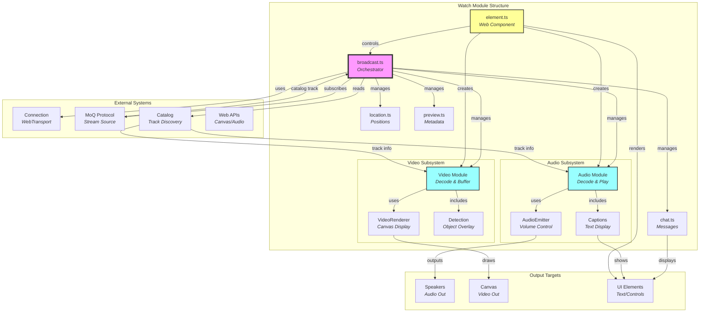
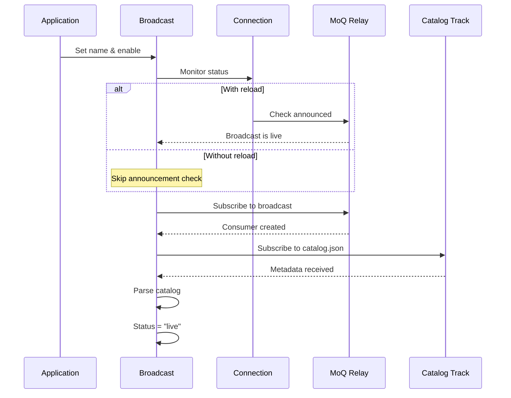
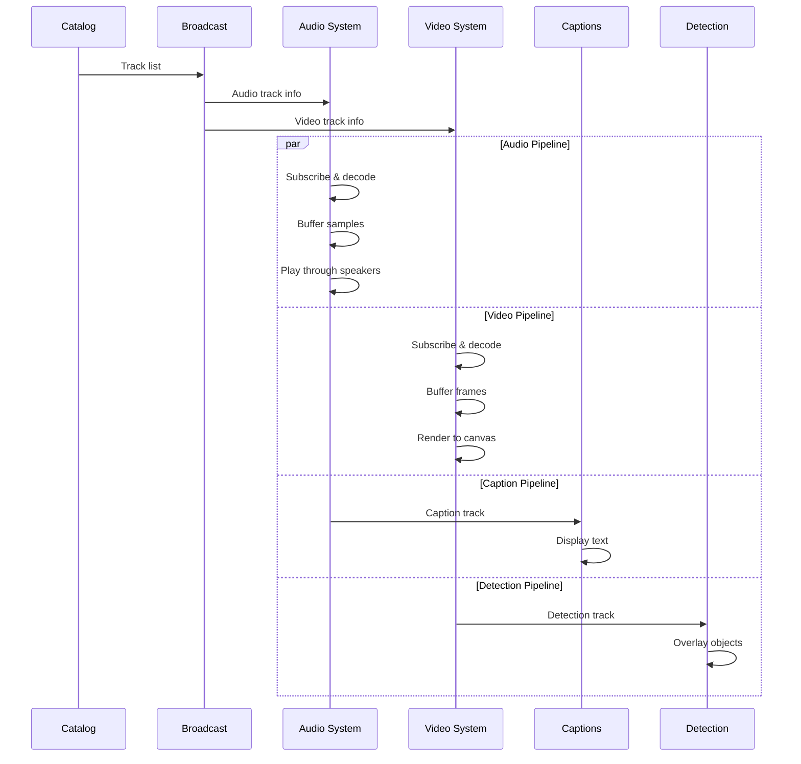
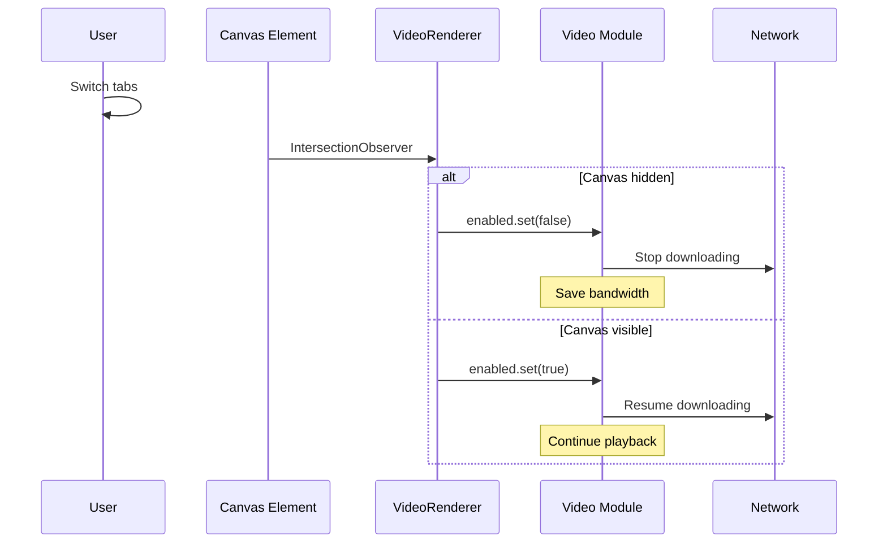

# Watch Module Documentation

## Overview

The watch module provides the **complete media consumption system** for real-time streaming playback. It orchestrates audio/video decoding, rendering, buffering, and metadata display through a unified broadcast interface. Think of it as the **media player** that transforms incoming MoQ streams into a complete viewing experience with synchronized audio, video, captions, chat, and spatial features.

> 💡 **For Beginners: What's "watching" a broadcast?**
> 
> Watching means receiving and playing back a live stream. Like tuning into a TV channel, you connect to a broadcast by name and the watch module handles everything: downloading tracks, decoding media, syncing audio/video, and displaying captions.

## Purpose

The watch module serves as the **broadcast consumption layer**, enabling:
- **Unified playback management** for all media types
- **Automatic track discovery** via catalog metadata
- **Adaptive streaming** with quality switching
- **Synchronized playback** of audio, video, and captions
- **Live/offline detection** with automatic reconnection
- **Web component interface** for easy HTML integration
- **Visibility-aware optimization** to save bandwidth

## Module Architecture

### Core Components

The watch module consists of:
- **Root orchestration files** - Broadcast management and coordination
- **Audio subsystem** - Audio decoding, buffering, and playback
- **Video subsystem** - Video decoding, rendering, and detection
- **Supporting features** - Chat, location tracking, preview display

### File Descriptions

#### `broadcast.ts` - Broadcast Consumer Orchestrator
**Achieves**: Orchestrates all consuming components into a cohesive playback experience with automatic track management.

The Broadcast class provides:

##### **Core Responsibilities**
- **Component Management** - Creates and coordinates all playback subsystems
- **Connection Monitoring** - Tracks WebTransport connection state
- **Catalog Reception** - Receives and parses broadcast metadata
- **Track Discovery** - Finds available audio/video/caption tracks
- **Status Tracking** - Reports offline/loading/live states

##### **Broadcast Lifecycle**
1. **Connection** - Establishes WebTransport session
2. **Announcement** - Waits for broadcast to go live (optional)
3. **Subscription** - Opens broadcast consumer
4. **Catalog** - Downloads metadata track
5. **Components** - Activates audio/video/chat based on catalog
6. **Updates** - Reacts to catalog changes (track switching)

##### **Status States**
- `offline` - Broadcast not available
- `loading` - Downloading catalog
- `live` - Actively playing content

##### **Reload Mechanism**
- Monitors broadcast announcements
- Auto-reconnects when broadcast goes live
- Can be disabled for immediate connection

#### `chat.ts` - Text Message Display
**Achieves**: Receives and displays real-time text messages from broadcasts.

Features:
- **Markdown support** - Rich text formatting
- **Frame-based delivery** - Each message as separate frame
- **Signal updates** - Reactive message display
- **Automatic cleanup** - Clears on disconnect

#### `location.ts` - Spatial Position Tracking
**Achieves**: Manages spatial positioning for multi-user environments with peer tracking.

The Location class enables:

##### **Self Position Tracking**
- Receives broadcaster's position
- Initial position from catalog
- Continuous updates via track
- Handle for requesting updates

##### **Peer Position Tracking**
The LocationPeer subsystem:
- Tracks specific peer positions
- Subscribes to peer update tracks
- Maintains position signals
- Enables spatial audio/video

##### **Position Flow**
- Initial position in catalog
- Updates track for changes
- Peer tracks for other users
- All positions as signals

#### `preview.ts` - Metadata Display
**Achieves**: Receives lightweight preview information without full media streams.

Features:
- **Low bandwidth** - JSON metadata only
- **Room info** - Title, description, thumbnail
- **Quick loading** - Available before media
- **Schema validation** - Type-safe parsing

#### `element.ts` - Web Component Interface
**Achieves**: Provides an HTML custom element for easy playback integration.

The `<hang-watch>` element offers:

##### **HTML Attributes**
- `url` - WebTransport endpoint
- `name` - Broadcast path
- `paused` - Playback state
- `volume` - Audio level (0-1)
- `muted` - Mute state
- `controls` - Show UI controls
- `captions` - Enable captions
- `reload` - Auto-reconnect on live

##### **Built-in UI Controls**
- Play/pause button
- Volume slider with mute
- Status indicator (offline/loading/live)
- Fullscreen button
- Caption display area

##### **Reactive Behavior**
- Attributes sync with internal state
- Auto-pause when canvas hidden
- Volume/mute coordination
- Status updates in real-time

#### `index.ts` - Module Exports
**Achieves**: Provides clean public API for the watch module.

Exports all components except the web element (requires separate import for tree-shaking).

## Architectural Relationships



> 💡 **For Beginners: Reading this diagram**
> 
> - **Pink (broadcast)** is the central orchestrator managing everything
> - **Blue (audio/video)** are the main media processing subsystems
> - **Yellow (element)** is the web component providing the HTML interface
> - **Arrows** show data flow and control relationships

## Data Flow Patterns

### Broadcast Connection Flow


### Multi-Track Playback Flow


### Visibility-Aware Optimization


## Key Design Principles

1. **Lazy Loading** - Components activate only when needed
2. **Signal-based State** - Reactive updates throughout the system
3. **Visibility Awareness** - Pause downloads when not visible
4. **Graceful Degradation** - Core playback works without extras
5. **Effect-based Lifecycle** - Automatic cleanup on disconnect
6. **Browser Optimization** - Works within frame/buffer limits

> 💡 **For Beginners: Why these principles matter**
> 
> - **Lazy loading** saves bandwidth by only downloading what's needed
> - **Signal-based** means UI updates automatically when state changes
> - **Visibility awareness** pauses video when you switch tabs
> - **Graceful degradation** means basic playback works even if AI features fail

## Configuration Patterns

### Minimal Playback
```typescript
// Just connect and play
const connection = new Connection(url);
const broadcast = new Broadcast(connection, {
  enabled: true,
  name: "stream/main"
});
```

### Full-Featured Playback
```typescript
// Everything enabled
const broadcast = new Broadcast(connection, {
  enabled: true,
  name: "conference/room-123",
  reload: true,  // Auto-reconnect
  audio: {
    enabled: true,
    latency: 100,
    captions: { enabled: true }
  },
  video: {
    enabled: true,
    detection: { enabled: true }
  },
  chat: { enabled: true },
  location: { enabled: true },
  preview: { enabled: true }
});

// Add playback controls
const videoRenderer = new VideoRenderer(broadcast.video, {
  canvas: document.querySelector("canvas")
});

const audioEmitter = new AudioEmitter(broadcast.audio, {
  volume: 0.8,
  muted: false
});
```

### HTML Integration
```html
<hang-watch
  url="wss://relay.example.com"
  name="conference/main"
  volume="0.8"
  controls
  captions>
  <canvas></canvas>
</hang-watch>
```

## Performance Considerations

- **Frame Buffering** - Limited to 2 frames (browser constraint)
- **Audio Latency** - 100ms default buffer
- **Visibility Culling** - Auto-pause when hidden
- **Catalog Caching** - Only updates on changes
- **Worker Isolation** - Detection in separate thread
- **Canvas Desync** - Better rendering performance

## Browser Compatibility

### Required APIs
- **WebTransport** - For MoQ protocol
- **WebCodecs** - For media decoding
- **AudioWorklet** - For audio playback
- **Canvas 2D** - For video rendering
- **IntersectionObserver** - For visibility
- **Custom Elements** - For web component

### Progressive Features
- **AudioContext** - Enhanced audio processing
- **VideoFrame** - Efficient frame handling
- **SharedArrayBuffer** - Future optimization
- **OffscreenCanvas** - Worker rendering

## Usage Patterns

### Programmatic Control
```typescript
// Create and configure
const connection = new Connection(url);
const broadcast = new Broadcast(connection);

// Control playback
broadcast.enabled.set(true);
broadcast.name.set("stream/main");

// Monitor status
broadcast.status.subscribe(status => {
  console.log("Playback:", status); // offline/loading/live
});

// Access subsystems
broadcast.audio.enabled.set(false); // Mute audio
broadcast.video.enabled.set(true);  // Enable video
```

### React Integration
```jsx
function StreamPlayer({ streamName }) {
  const playerRef = useRef();
  
  useEffect(() => {
    const player = playerRef.current;
    player.url = "wss://relay.example.com";
    player.name = streamName;
    
    return () => player.close();
  }, [streamName]);
  
  return (
    <hang-watch ref={playerRef} controls captions>
      <canvas />
    </hang-watch>
  );
}
```

### Multi-User Spatial
```typescript
// Track broadcaster position
broadcast.location.current.subscribe(pos => {
  updateBroadcasterAvatar(pos);
});

// Track peer positions
const peer = broadcast.location.peer("user-123");
peer.location.subscribe(pos => {
  updatePeerAvatar("user-123", pos);
});
```

### Custom Audio Processing
```typescript
// Access audio graph for visualization
broadcast.audio.root.subscribe(node => {
  if (!node) return;
  
  const analyzer = new AnalyserNode(node.context);
  node.connect(analyzer);
  
  // Create audio visualizer
  renderSpectrum(analyzer);
});
```

## Best Practices

1. **Check Connection** - Verify connected before enabling
2. **Handle Status** - React to offline/loading/live states
3. **Monitor Buffering** - Check audio.buffered property
4. **Clean Shutdown** - Call close() when done
5. **Volume Safety** - Limit maximum volume levels
6. **Error Boundaries** - Wrap components in error handlers
7. **Frame Management** - Let system handle VideoFrame lifecycle

## Common Patterns

### Auto-play with Mute
```typescript
// Browsers require mute for auto-play
const broadcast = new Broadcast(connection, {
  enabled: true,
  audio: { enabled: false }, // Start muted
  video: { enabled: true }
});

// Unmute after user interaction
button.onclick = () => {
  broadcast.audio.enabled.set(true);
};
```

### Quality Switching
```typescript
// Monitor catalog for available qualities
broadcast.catalog.subscribe(catalog => {
  const videos = catalog?.video || [];
  // Switch based on bandwidth/preference
});
```

### Synchronized Playback
```typescript
// Use buffered property to sync
const audioBuffered = broadcast.audio.buffered;
const targetLatency = 100; // ms

if (audioBuffered < targetLatency * 0.5) {
  // Pause video to let audio catch up
  videoRenderer.paused.set(true);
} else {
  videoRenderer.paused.set(false);
}
```

## Debugging Tips

1. **Check Status** - Monitor broadcast.status signal
2. **Verify Catalog** - Log catalog updates
3. **Track Subscriptions** - Ensure tracks exist in catalog
4. **Audio Context** - Check if suspended
5. **Frame Count** - Monitor video frame updates
6. **Network Tab** - Verify WebTransport connections
7. **Console Logs** - Enable debug logging

## Common Issues

### No Playback
```typescript
// Check connection
console.log(connection.status.peek()); // Should be "connected"

// Check broadcast status
console.log(broadcast.status.peek()); // Should be "live"

// Check catalog
console.log(broadcast.catalog.peek()); // Should have tracks
```

### Audio Not Playing
```typescript
// Resume AudioContext
broadcast.audio.root.subscribe(node => {
  if (node?.context.state === "suspended") {
    node.context.resume();
  }
});
```

### Video Stuttering
```typescript
// Check frame updates
let frameCount = 0;
broadcast.video.frame.subscribe(() => {
  console.log("Frame", ++frameCount);
});

// Increase audio buffer
const broadcast = new Broadcast(connection, {
  audio: { latency: 200 } // Larger buffer
});
```

## Future Enhancements

- **Adaptive Bitrate** - Automatic quality switching
- **DVR Controls** - Seek within buffer
- **Picture-in-Picture** - PiP API support
- **Screen Wake Lock** - Prevent sleep during playback
- **Network Adaptation** - Adjust buffer based on conditions
- **Synchronized Streams** - Multi-angle viewing