# Watch/Video Module Documentation

## Overview

The watch/video module provides **real-time video decoding and rendering** capabilities for consuming video streams. It receives encoded video tracks via MoQ, decodes them using WebCodecs, manages frame buffering, renders to HTML canvas, and optionally displays object detection overlays. Think of it as the **video playback pipeline** that transforms streaming media into visible frames with AI-enhanced annotations.

> 💡 **For Beginners: What's video "watching" in streaming?**
> 
> "Watching" video means receiving, decoding, and displaying video frames in real-time. This module handles the complex process of turning compressed video data into smooth playback on your screen.

## Purpose

The video module serves as the **video consumption layer**, enabling:
- **Video decoding** from H.264, VP9, AV1, or other codecs
- **Frame buffering** for smooth playback
- **Canvas rendering** with automatic resizing
- **Visibility detection** to pause when off-screen
- **Object detection** overlay from AI metadata
- **Track switching** for adaptive quality

## File Descriptions

### `index.ts` - Video Playback Core
**Achieves**: Orchestrates the complete video playback pipeline from subscription to frame display.

The Video class provides:

#### **Core Components**
- **Track Subscription** - Consumes video tracks from broadcast
- **Decoder Setup** - Configures WebCodecs for stream codec
- **Frame Management** - Maintains current and next frame
- **Detection Integration** - Manages object detection display
- **Catalog Monitoring** - Tracks video configuration changes

#### **Video Processing Pipeline**
1. **Track Discovery** - Finds video track in catalog
2. **Subscription** - Opens stream for video track
3. **Frame Reception** - Receives encoded video chunks
4. **Keyframe Detection** - Identifies IDR frames (frame === 0)
5. **Decoding** - Converts compressed video to VideoFrame
6. **Frame Buffering** - Maintains current + next frame
7. **Frame Rotation** - Advances frames for display

#### **Frame Management Strategy**
- **Current Frame** - The frame being displayed
- **Next Frame** - Buffered frame for smoother playback
- **Frame Rotation** - Old frame closed, next becomes current
- **Browser Limits** - Works around 2-frame limit in Firefox

#### **Configuration Properties**
- `enabled` - Whether to download and decode video
- `detection` - Object detection overlay settings

#### **Key Features**
- **Seamless Switching** - Keeps frames when changing tracks
- **Optimized Latency** - Configures decoder for real-time
- **Automatic Cleanup** - Closes frames to prevent leaks
- **Error Recovery** - Handles decoder errors gracefully

### `detection.ts` - Object Detection Overlay
**Achieves**: Receives and displays AI-generated object detection metadata synchronized with video.

The Detection class provides:

#### **Detection Pipeline**
1. **Catalog Discovery** - Finds detection track metadata
2. **Track Subscription** - Opens detection data stream
3. **JSON Parsing** - Decodes detection frame data
4. **Schema Validation** - Ensures data integrity
5. **Signal Updates** - Publishes objects for overlay

#### **Configuration**
- `enabled` - Whether to download detection data

#### **Output Signals**
- `objects` - Array of detected objects with:
  - `label` - Object class name
  - `score` - Confidence (0-1)
  - `x, y` - Normalized position (0-1)
  - `w, h` - Normalized dimensions (0-1)

#### **Performance Optimization**
- Function setter avoids deep equality checks
- Clears objects when detection stops

### `renderer.ts` - Canvas Rendering Engine
**Achieves**: Renders video frames to HTML canvas with visibility-aware optimization.

The VideoRenderer class provides:

#### **Rendering Pipeline**
1. **Canvas Setup** - Configures 2D rendering context
2. **Frame Scheduling** - Uses requestAnimationFrame
3. **Canvas Sizing** - Matches video dimensions
4. **Frame Drawing** - Renders VideoFrame to canvas
5. **Visibility Detection** - Pauses when off-screen

#### **Visibility Optimization**
- **IntersectionObserver** - Detects canvas visibility
- **Threshold 1%** - Triggers on minimal visibility
- **Auto-pause** - Stops downloads when hidden
- **Auto-resume** - Restarts when visible again

#### **Canvas Management**
- **Desynchronized Context** - Better performance
- **Aspect Ratio** - Preserves video proportions
- **Dynamic Sizing** - Adjusts to frame dimensions
- **Hidden State** - Hides canvas when no video

#### **Configuration Properties**
- `canvas` - Target HTMLCanvasElement
- `paused` - Manual pause control

#### **Rendering Features**
- **Black Background** - Clears before each frame
- **Continuous Loop** - Renders at display refresh rate
- **State Management** - Tracks animation frame ID
- **Clean Shutdown** - Cancels pending renders

## Architectural Relationships


> 💡 **For Beginners: Understanding video flow**
> 
> 1. Compressed video arrives from network (MoQ)
> 2. WebCodecs decoder converts to raw frames
> 3. Frames are buffered (current + next)
> 4. Canvas renders frames at display rate
> 5. Detection data arrives separately for overlays

## Processing Pipeline

### Video Playback Flow

```mermaid
sequenceDiagram
    participant MoQ as MoQ Stream
    participant Decoder as VideoDecoder
    participant Buffer as Frame Buffer
    participant Renderer as Canvas Renderer
    participant Display as Screen
    
    MoQ->>Decoder: EncodedVideoChunk
    
    alt Keyframe
        Decoder->>Decoder: Reset decoder state
    end
    
    Decoder->>Buffer: VideoFrame
    
    alt No current frame
        Buffer->>Buffer: Set as current
    else Has current, no next
        Buffer->>Buffer: Set as next
    else Has both
        Buffer->>Buffer: Rotate frames
        Note over Buffer: Close old current<br/>Next → Current<br/>New → Next
    end
    
    loop Animation Frame
        Renderer->>Buffer: Get current frame
        Buffer-->>Renderer: VideoFrame
        Renderer->>Display: Draw to canvas
    end
```


### Visibility-Aware Rendering


### Detection Overlay Flow


## Key Design Principles

1. **Frame Economy** - Minimal frame buffering due to browser limits
2. **Visibility Awareness** - Pause downloads when not visible
3. **Seamless Switching** - Keep frames during track changes
4. **Real-time Optimization** - Decoder configured for low latency
5. **Resource Management** - Explicit frame lifecycle management

> 💡 **For Beginners: Why these principles matter**
> 
> - **Frame economy** - Browsers limit VideoFrame objects to prevent memory exhaustion
> - **Visibility awareness** - Saves bandwidth and CPU when tab is hidden
> - **Seamless switching** - No black frames when quality changes
> - **Resource management** - VideoFrames must be explicitly closed or they leak

## Configuration Details

### Video Settings
- **Codec Support** - Any WebCodecs-supported format
- **Optimize For Latency** - Always enabled for real-time
- **Frame Buffer** - 2 frames (current + next)
- **Keyframe Detection** - frame === 0 indicates IDR

### Rendering Settings
- **Canvas Context** - 2D with desynchronized hint
- **Render Rate** - Display refresh rate (via RAF)
- **Visibility Threshold** - 1% of canvas must be visible
- **Background** - Black (cleared each frame)

### Detection Settings
- **Format** - JSON array of objects
- **Coordinates** - Normalized 0-1 range
- **Update Rate** - Per-frame synchronized
- **Schema Validation** - Zod-based type safety

## Performance Considerations

- **Frame Limits** - Firefox allows only 2 VideoFrames
- **Canvas Desync** - Better performance with desynchronized
- **RAF Scheduling** - Matches display refresh rate
- **Visibility Culling** - Stops processing when hidden
- **Frame Closing** - Prevents decoder pipeline stalls

## Browser Compatibility

### Required APIs
- **VideoDecoder** - WebCodecs for decoding
- **VideoFrame** - Decoded frame objects
- **Canvas 2D** - For rendering frames
- **IntersectionObserver** - For visibility detection
- **requestAnimationFrame** - For render scheduling

### Known Limitations
- **Firefox** - Maximum 2 outstanding VideoFrames
- **Safari** - Limited codec support
- **Mobile** - Hardware decoder limitations
- **Memory** - Large frames may cause issues

## Usage Patterns

### Basic Video Playback
```typescript
const video = new Video(broadcast, catalog, {
  enabled: true
});

const renderer = new VideoRenderer(video, {
  canvas: document.querySelector("canvas"),
  paused: false
});
```

### With Object Detection
```typescript
const video = new Video(broadcast, catalog, {
  enabled: true,
  detection: { enabled: true }
});

// React to detected objects
video.detection.objects.subscribe(objects => {
  if (objects) {
    drawBoundingBoxes(canvas, objects);
  }
});
```

### Manual Control
```typescript
// Pause rendering but keep downloading
renderer.paused.set(true);

// Stop downloading entirely
video.enabled.set(false);

// Switch video quality
catalog.set(newCatalogWithDifferentVideo);
```

### Visibility Optimization
```typescript
// Automatic - renderer handles it
const renderer = new VideoRenderer(video, {
  canvas: myCanvas
});
// Downloads pause when canvas is hidden

// Manual override
video.enabled.set(true); // Force download even if hidden
```

## Best Practices

1. **Close Frames** - Always close VideoFrames when done
2. **Monitor Buffer** - Watch for frame drops
3. **Handle Errors** - Decoder errors should trigger recovery
4. **Size Canvas** - Match video dimensions for best quality
5. **Clean Shutdown** - Call close() to release resources

## Debugging Tips

1. **Black Screen** - Check if frames are being decoded
2. **Stuttering** - Monitor frame buffer state
3. **Memory Leaks** - Ensure frames are closed
4. **Wrong Size** - Check canvas dimensions match video
5. **Not Playing** - Verify canvas is visible

## Common Issues

### Video Not Playing
```typescript
// Check if enabled
console.log(video.enabled.peek()); // Should be true

// Check if frames arriving
video.frame.subscribe(frame => {
  console.log("Got frame:", frame);
});

// Check canvas visibility
const rect = canvas.getBoundingClientRect();
console.log("Canvas visible:", rect.width > 0 && rect.height > 0);
```

### Frame Drops
```typescript
// Monitor decoder queue
let frameCount = 0;
video.frame.subscribe(() => {
  console.log("Frame", ++frameCount);
});
```

### Detection Not Working
```typescript
// Verify detection track exists
catalog.subscribe(cat => {
  console.log("Has detection:", !!cat?.detection);
});

// Check detection data
video.detection.objects.subscribe(objects => {
  console.log("Detected:", objects?.length ?? 0, "objects");
});
```

## Future Enhancements

- **Higher Frame Buffering** - Store encoded data for larger buffers
- **Adaptive Quality** - Automatic track switching based on bandwidth
- **Picture-in-Picture** - Support PiP API
- **WebGPU Rendering** - Hardware-accelerated canvas operations
- **Frame Interpolation** - Smooth playback at higher rates